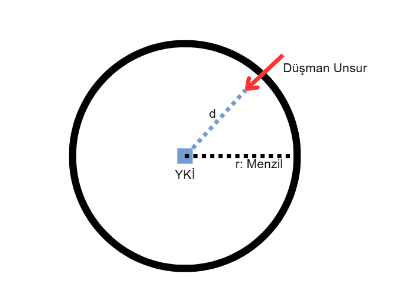
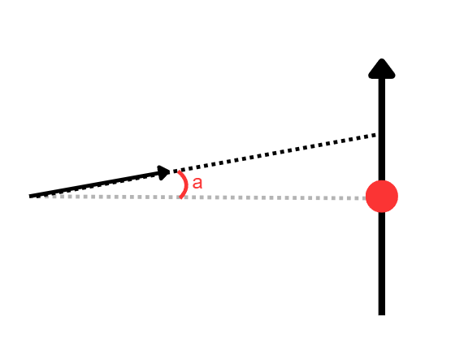
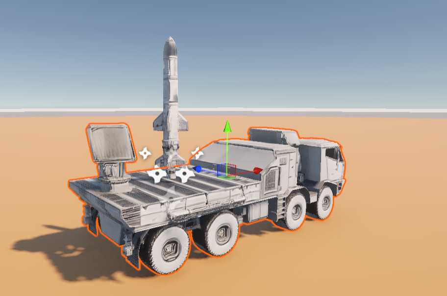
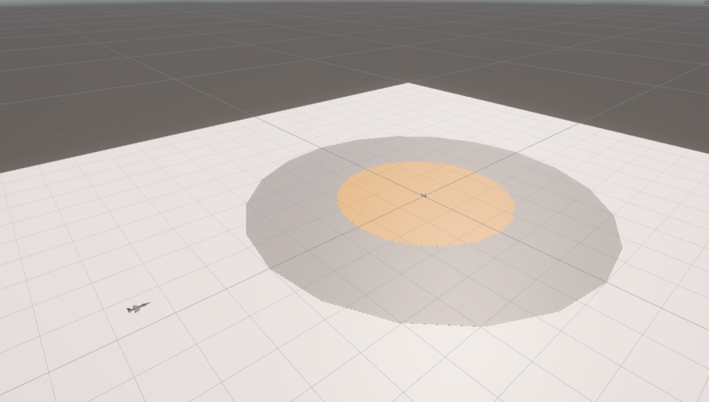
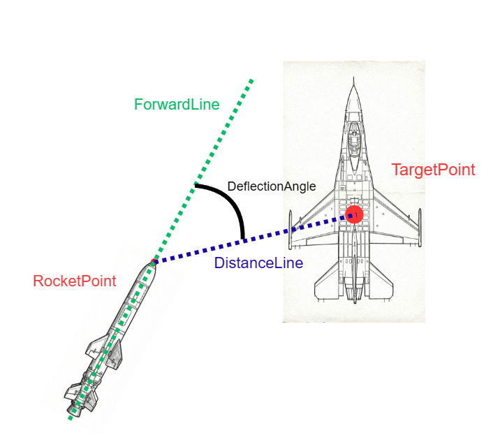

# ADS-AI Hava Savunma Sistemi

> Bu doküman, **tamamlanmış bir ürün kılavuzu** değil, proje için bugüne kadar yapılan **tasarım ve geliştirme adımlarının özeti** olarak hazırlanmıştır. Hem Unity sahne tasarımı hem de Python/PPO eğitim altyapısı hâlen geliştirme aşamasındadır.

## 1. Genel Proje Amacı
Yapay zeka destekli bir roketin hava aracını vurması hedeflenmektedir. Roketin hedef takibi ve yönelimi Pekiştirmeli Öğrenme (RL) Algoritması ile gerçekleşecektir. Hedef unsur menzile girdiğinde otomatik ateşleme ile roket ateşlenecek ve adım adım RL algoritması ile hedef yaklaşımı planlanacaktır.

## 2. İlk Hedeflenen Proje Unsurları
Projenin temel unsurları roket ve hava unsurlarıdır (dost veya düşman). Dost ve düşman hava unsurları için doğru kilitlenme seçimi kurgulanmaktadır. Eğitim süreci başlangıçta tekli ajan (Single-Agent) ile yürütülecek, ileride çoklu ajan (Multi-Agent) kurgusuna geçilecektir.

## 3. Ölçümler
Uzaklık hesaplamalarında GPS yerine Öklid mesafesi (LIDAR veya Raycast benzeri geometrik ölçümler) kullanılacaktır.

## 4. Öğrenme Türü: Curriculum Learning (Müfredatlı-Aşamalı Öğrenme)
CL, durum uzayının alt parçalara bölünerek eğitimin parça parça yapılmasıdır. Model ilk irtifa seviyesini (h) öğrendikten sonra kademeli olarak irtifa artırılarak eğitim genişletilir.

### Müfredatlı Öğrenme Yaklaşımları:
1. **Yaklaşım (1):** Hedef, hmin ile h arasında rastgele başlatılır. Başarı oranı arttığında aralık (hmin, h+a) arasına çekilir ve (hmin, hmax) olana kadar devam eder. Önceki eğitimlerden gelen bilgilerle daha stabil ağırlık güncellemesi sağlar ancak yavaş eğitim ve unutma problemi riski taşır.
2. **Yaklaşım (2):** Hedef ilk etapta hmin ile h arasında başlatılır. Başarı sağlandığında sadece yeni aralıkta (h, h+a) başlatılarak devam eder. Daha hızlı öğrenme sağlasa da dalgalanma ve gradyan patlaması riski oluşturabilir.
3. **Yaklaşım (3):** İkinci yaklaşımın varyasyonu olup, yeni etap (h-e, h+a) arasında kurgulanır. Bu sayede sadece yeni durumlar değil, önceki etaplardan da bir miktar eski veri gösterilir. Ağırlıkların daha stabil güncellenmesini sağlayarak hızı ve istikrarı dengeler.

## 5. Planlanan Parametreler

### 5.1. Durumlar (States)
RL ajanı doğrudan dünya koordinatlarındaki ham Euler/Quaternion dönüşümleriyle uğraşmak yerine, roketin kendi gözünden oluşturulan "Guidance-Oriented" (Güdüm odaklı) zengin bir veri setiyle eğitilecektir:
1. **Hedef Yönü (target_dir_x, y, z):** Roketten hedefe giden birim vektör (yerel koordinatlarda).
2. **Göreli Hız (rel_vel_x, y, z):** Hedefin rokete göre bağıl hızı. Hedefin nereye kaydığını ifade eder.
3. **Roket Hızı ve Açısal Hızı (roc_vel, roc_ang_vel):** Aşırı salınımları (overshoot) engellemek için roketin kendi lineer ve açısal (x, y, z) hız değerleri.
4. **Yerçekimi Vektörü İzdüşümü (gx, gy, gz):** Roketin yönelimini (Up/Down) dünya eksenlerine göre anlamlandırması için yerel eksendeki izdüşümler.
5. **Mesafe ve Kapanma Hızı (distance, closing_rate):** Hedef ile roket arası toplam mesafe ve bu mesafenin zamanla değişim hızı (türev).
6. **İrtifa ve Geçiş Ağırlığı (roc_h, blend_w):** Roketin yerden yüksekliği (çarpışma mantığı için) ve dikey kalkıştan yatay takibe geçişteki kontrol ağırlığı.

Hedef ve roket arasındaki hiza, mesafe ve açı ilişkisi sistemin başarısı için kritik öneme sahiptir.

### 5.2. Aksiyonlar (Actions)
Ajanın üreteceği çıktılar normalize (-1 ile 1 arası) şekilde Unity tarafına iletilecektir:
1. **Thrust (Ana İtki):** Dikey itki kuvveti `main_thrust_cmd`.
2. **Pitch ve Yaw Komutları:** Roketin yönelimi `pitch_cmd` ve `yaw_cmd` üzerinden kontrol edilecektir. Unity tarafında bu komutlar `AddTorque` / `AddRelativeTorque` olarak eyleyicilere dönüştürülecektir.
*Not: Roll (kendi ekseni etrafında dönme) ilk aşamalarda eksenler arası karmaşayı (cross-coupling) engellemek adına kapatılmış veya yüksek oranda sönümlenmiş olacaktır.*

### 5.3. Ödüller ve Terminal Durumları (Rewards & Done)
Ödül mekanizması ve bölüm sonu (terminal) durumları daha güvenli bir uçuş alanı öğretmek için güncellenmiştir:
1. **İrtifa Cezaları:** Yere fiziksel çarpma beklemek yerine roketin irtifası (`roc_h`) kritik seviyenin altına düştüğünde (veya çok yükseldiğinde) terminal fail sayılır.
2. **Zaman Aşımı (Timeout):** Sınır ihlali algılaması yerine doğrudan adım sayısı limiti üzerinden "Timeout" fail'ı kullanılır.
3. **Mesafe ve Yaklaşma Hızı:** Hedefe uygun hız ve doğrultuyla yaklaşıldıkça ödül alınır.
4. **Proximity Success (Yakınlık Başarısı):** Hedefi vurma tespiti sadece fiziksel collider temasından ibaret değildir; roketin hedefe belirli bir eşik mesafenin altına düşmesi (early explosion) ve uygun angajman açısında bulunması "Success" (Hit) olarak sayılır.

## 6. Taslak Environment Görünümü
Hızlı ve stabil bir eğitim süreci için roket hızı belirli bir aralıkta tutularak öncelikle takip-yönelim davranışının öğrenilmesi planlanmıştır.

Hedef uçak, fırlatma rampası hizasından yatay düzlemde +/- 60 derece açı aralığında rastgele bir doğrultu ile başlatılmaktadır.

## 7. Çevre Boyutları ve Rastgele Başlatma
* **Çevre Boyutları:** `Ground` (100x100 düzlem, yaklaşık 1000m x 1000m'ye denk düşer), `Range` (500x500 dairesel alan), `Border` (800x800 dairesel bölge).
* **Hedef Başvurusu:** Hedef uçak fırlatma noktasından (merkezden) tahmini 300m uzaklıkta ve 50m yükseklikte konumlanır. Merkeze dönük bir doğrultuda başlatılsa da yatay düzlemde +/- 60 derece aralığında rastgele sapmalar uygulanır. Bu durum Curriculum Learning (CL) felsefesiyle birleşerek kademeli eğitim ortamı oluşturur.

## 8. Fiziksel Model Özellikleri

### Yer Kontrol İstasyonu (YKİ) - Rampa:
Roketin ateşleneceği platform, ASELSAN Gürz HSS sistemine benzer bir tasarımda kurgulanmıştır.

### Roket Özellikleri:
ROKETSAN Atmaca füzesi temel alınarak basitleştirilmiş bir model tasarlanmıştır.

### Hedef Özellikleri:
Hava hedefi olarak F16 benzeri uçak modeli kullanılmaktadır.

---

## 9. Proje Environment ve Kod Tasarımı

### 9.1. Temel Sınıf ve Modüller
* **train.py:** Main run ve eğitim döngüsü, loglama ve model yönetimi.
* **agent.py:** PPO algoritması ve model mimarisi.
* **env.py:** RL ortam arayüzü ve ödül hesaplamaları.
* **connector.py:** Python tarafındaki TCP soket haberleşmesi.
* **env.cs:** Unity tarafında aksiyon uygulama ve durum okuma.
* **connector.cs:** Unity tarafındaki TCP soket haberleşmesi.

### 9.2. Unity Sahne Ögeleri, Hiyerarşisi ve Fiziksel Geliştirmeler
Sahnede Ground (Zemin), Ramp (Rampa), Rocket (Roket), Target (Hedef) ve CombatManager bileşenleri **bağımsız (independent)** bir hiyerarşi ile konumlandırılmıştır.

Bugüne kadar oluşturulan teknik mimari, Unity ögeleri ve geliştirilmiş özellikleri özetle şöyledir:

- **CombatManager (Orkestra Şefi)**
  - Sahnedeki mesafeyi ölçmekten, çizgileri (`DistanceLine`, `ForwardLine`) eşzamanlı olarak güncellemekten ve roketin yönelim algoritmalarını (GNC) yönlendirmekten sorumlu merkezi yönetim birimidir. Vuruş anlarını izler ve patlama FX'lerini tetikler.

- **Ground, Range ve Border (Zemin ve Sınırlar)**  
  - Referans düzlemin ve operasyon alanının sınırlarını çizer. Unity zemin düzlemi çarpanı göz önüne alınarak geniş ölçekli (`100` Scale) tasarlanmıştır.

- **Ramp (Rampa / Fırlatıcı)**  
  - Roketin fırlatıldığı (ilk etapta dik doğrultuda) Kamyonet/HSS bataryasını simgeleyen modeldir.

- **Rocket (Roket)**  
  - **Fizik Ayarları:** Yüksek hızlardaki çarpışma kaçaklarını önlemek için Rigidbody bileşeninde `Continuous Dynamic` çarpışma algılama ve `Interpolate` özellikleri aktif edilmiştir.
  - **Referans Noktası (`NosePoint`):** Roketin tam ucunda konumlanan, arayıcı başlığın ve gövdenin hedefe olan asıl bakış/mesafe kaynağı.
  - **Görsel FX:** Roket hareket ettiği yönün tersine dinamik olarak `Exhaust_FX` (Simulation: World ayarlı) duman/alev partikül izi bırakır.

- **Target (Hedef Uçak)**  
  - **Hurtbox ve Yakınlık Tapası:** Geleneksel katı model çarpışması yerine uçağı da kapsayan geniş bir `Box Collider` ("Is Trigger" aktif) konulmuştur. Bu, roketin sekmeksizin "proximity fuse" (yakınlık tapası) etkisini tetiklemesini ve vuruş doğrulaması yapılmasını sağlar.
  - **Referans Noktası (`TargetPoint`):** Uçağın ağırlık merkezinde konumlanan kilitlenme referansı.
  - **Görsel FX:** Vuruş anında tek seferlik parça ve alev saçılımı olan `Explosion_FX` tetiklenir.

- **İzleme ve Görselleştirme Araçları (Debug Lines)**  
  - `ForwardLine` (Kırmızı): Roketin `NosePoint` ucundan ileri doğru uzanan hareket/bakış doğrultusu (heading).
  - `DistanceLine` (Sarı/Mavi): `NosePoint` ile `TargetPoint` arasında çekilen dinamik "Görüş Hattı" (Line of Sight - LOS).

Aksiyon uygulama modülleri ve TCP tabanlı `JSON` veri paketleme yapısı `env.cs` ve `connector.cs` üzerinden esnek ve ölçeklenebilir bir biçimde kurgulanmaktadır. Veriler ham string ayrıştırma yerine doğrudan sözlük (dictionary/json) yapılarına çevrilerek Unity ve Python arasında modülerce akar.

Rampa ve roketin fiziksel yerleşimi:

Hedef uçak modeli:

Tüm simülasyon sahası genel görünümü:

## 10. Geometrik Ölçüm Sistemleri

### 10.1. Mesafe (d) Hesaplaması
Mesafe ölçümü roket burnu ile hedef merkezi noktaları üzerinden yapılır.

* **RocketPoint:** Roketin burnundaki referans ölçüm noktası.

* **TargetPoint:** Hedef merkezindeki referans kilitlenme noktası.

* **DistanceLine:** İki nokta arasındaki mesafe hattı.

### 10.2. Yönelim ve Sapma Hesabı
Roket gövde doğrultusu (ForwardLine) ile mesafe hattı (DistanceLine) arasında kalan sapma açısı (DeflectionAngle) hesaplanmaktadır.

## 11. Çarpışma ve Vuruş Mantığı (Hurtbox & Proximity)
Yüksek hızlı objelerin birbirinin içinden geçmesini (tünelleme) engellemek ve "Yakınlık Tapası" (Proximity Fuse) sistemini simüle etmek için doğrudan "Rigid Collision" yerine "Trigger/Hurtbox" modeli kullanılmıştır. Uçağın etrafındaki hacimsel trigger alanına roketin giriş yapması (`OnTriggerEnter` vb.) vuruş tayini için birincil kontrol mekanizmasıdır. RL eğitiminde ekstra fayda sağlaması için tam fiziksel çarpma öncesi (early explosion) hedefe yaklaşma kriteri de sisteme entegre edilebilir.

## 12. Eğitim Altyapısı ve PPO Yapısı

Bu projede roketin hedefi takip etmesi ve vurması için **Proximal Policy Optimization (PPO)** tabanlı bir pekiştirmeli öğrenme yapısı kullanılmaktadır. Eğitim süreci Python tarafında TensorFlow tabanlı bir ajan ile, Unity tarafındaki simülasyon ortamı arasında TCP soket üzerinden haberleşerek yürütülür.

### 12.1. Python Eğitim Modülleri

Python tarafında temel modüller aşağıdaki gibidir:

1. **`train.py`**  
   - Ana eğitim döngüsünü (`main runtime`) içerir.  
   - Ortam (`Env`) ve ajan (`PPOAgent`) nesnelerini oluşturur.  
   - Rollout toplama, güncelleme döngüleri, model kaydetme ve loglama akışını yönetir.

2. **`env.py`**  
   - Unity ortamı ile TCP soket üzerinden haberleşen RL arayüzünü sağlar.  
   - Her adımda aksiyonu gönderir, gözlemi ve ödülü alır, `done` bilgisini ve ek `info` alanlarını üretir.  
   - `reset()` fonksiyonu ile rastgele başlangıç koşullarını (pozisyon, yönelim vb.) ayarlar ve yeni bölümü başlatır.  
   - `calculate_reward()` fonksiyonu ile; mesafe, kapanma hızı, hedef irtifası vb. ölçümler üzerinden detaylı ödül hesaplaması yapar.  
   - `close()` fonksiyonu ile bağlantıyı güvenli şekilde kapatır.

3. **`agent.py`**  
   - PPO ajanının sinir ağı mimarisi ve güncelleme (policy/value) adımlarını içerir.  
   - `act()` fonksiyonu ile mevcut durumdan aksiyon, log-olasılık ve değer tahmini üretir.  
   - `train()` fonksiyonu ile avantaj hesapları, kayıp fonksiyonları ve ağırlık güncellemelerini gerçekleştirir.

4. **`settings.py`**  
   - Eğitim ve model kayıt ayarlarını merkezi olarak yönetir.  
   - IP/PORT, rollout uzunluğu, toplam güncelleme sayısı, model kayıt aralıkları gibi sabitleri barındırır.  
   - GPU kullanımını ayarlayan `setup_gpu()` fonksiyonunu içerir.  
   - Model ve ajan durumunu diskten yükleme/kaydetme işlevlerini (`load_checkpoint`, `save_checkpoint`) sağlar.

5. **`log.py`**  
   - Eğitim sürecine ait metriklerin CSV formatında kayıt edilmesini ve konsol çıktılarının okunaklı şekilde yazdırılmasını sağlar.  
   - Her adım (step), bölüm (episode) ve güncelleme (update) için özet bilgileri kaydeder.  
   - Eğitim sürecini hem anlık olarak takip etmeye hem de sonradan analiz etmeye imkân verir.

### 12.2. PPO Eğitim Döngüsü Özeti

Eğitim süreci kabaca şu adımlarla ilerler:

1. Unity ortamı başlatılır, Python tarafındaki `Env` nesnesi sokete bağlanır.  
2. `train.py` içinde PPO ajanı ve ortam oluşturulur, varsa son kayıtlı model ve durum yüklenir.  
3. Her **update** için sabit uzunlukta bir **rollout** toplanır:  
   - Ajan, mevcut durum `state` için aksiyon üretir.  
   - Ortam bu aksiyonu uygular, yeni durumu ve ödülü döndürür.  
   - `state`, `action`, `reward`, `done`, `value` ve log-olasılık değerleri rollout buffer’larına kaydedilir.  
4. Rollout tamamlandığında, son durumda ajan değeri kullanılarak avantajlar ve hedefler hesaplanır.  
5. PPO kayıpları (policy, value, entropy) üzerinden model güncellenir.  
6. Belirli aralıklarda model ve ajan durumu disk üzerine kaydedilir (checkpoint).  
7. Toplam güncelleme sayısı tamamlandığında son model kaydedilir ve eğitim sonlandırılır.

Bu yapı sayesinde **müfredatlı öğrenme senaryoları**, farklı başlangıç irtifaları ve yönelimleriyle desteklenerek, roketin daha kararlı ve genellenebilir bir takip-vurma davranışı öğrenmesi hedeflenmektedir.

## 13. Model Kayıt ve Checkpoint Sistemi

Eğitim sırasında modelin belirli aralıklarla kaydedilmesi ve gerektiğinde kaldığı yerden devam edebilmesi için bir checkpoint sistemi kullanılmaktadır.

- **Model dosyaları (`.keras`)**  
  - `MODELS_DIR` altında `ppo_model_up{UPDATE_ID}.keras` formatında saklanır.  
  - Sinir ağı ağırlıklarını içerir.

- **Ajan durum dosyaları (`.pkl.gz`)**  
  - `ppo_state_up{UPDATE_ID}.pkl.gz` formatında saklanır.  
  - Özellikle ajan içinde öğrenilen log-standart sapma (`log_std`) gibi parametreleri içerir.  
  - Sıkıştırılmış (`gzip`) pickle formatı ile kayıt edilir.

**Yükleme senaryosu:**

1. Eğitim başlarken `load_checkpoint()` en son kayıtlı güncellemeyi (update id) bulur.  
2. Eğer bir model bulunursa, ilgili `.keras` ve `.pkl.gz` dosyaları yüklenir.  
3. Eğitim, kaldığı güncelleme sayısının bir sonrasından devam eder.  
4. Eğer kayıt bulunamazsa, eğitim sıfırdan başlatılır.

Bu mekanizma; uzun eğitim süreçlerinde kesintiler yaşansa bile projenin **tekrar kullanılabilir ve sürdürülebilir** bir şekilde ilerlemesini sağlar.

## 14. Loglama ve İzleme Altyapısı

Eğitim süreçlerinin şeffaf ve analiz edilebilir olması için kapsamlı bir loglama altyapısı tasarlanmıştır.

### 14.1. CSV Log Dosyaları

`log.py` modülü; adım, bölüm ve güncelleme seviyesinde CSV formatında log dosyaları üretir. Örnek alanlar:

- Zaman damgası, update kimliği, bölüm kimliği ve adım numarası  
- Mesafe, kapanma oranı, irtifa gibi durum bileşenleri  
- Ödül, bölüm sonu sebebi (`done_reason`) ve diğer tanılayıcı bilgiler

Bu sayede:

- Eğitim sürecindeki **öğrenme eğrileri** (örneğin ortalama ödül, bölüm uzunluğu) kolayca çıkarılabilir.  
- Farklı müfredat senaryolarının ve hiperparametre ayarlarının karşılaştırması yapılabilir.  
- Anomali durumları (aşırı dalgalanma, takılma vb.) tespit edilebilir.

### 14.2. Konsol Çıktıları

`log.py` ayrıca eğitim sırasında terminale düzenli özetler basar:

- Belirli her birkaç adımda: Mesafe, irtifa, kapanma oranı vb. metrikler  
- Her bölüm sonunda: Toplam ödül, bölüm uzunluğu, başlangıç ve bitiş koşulları  
- Her güncelleme sonunda: Loss bileşenleri (policy, value, entropy, KL vb.)

Bu çıktılar, uzun eğitimler sırasında süreci **gerçek zamanlı izlemenizi** kolaylaştırır.