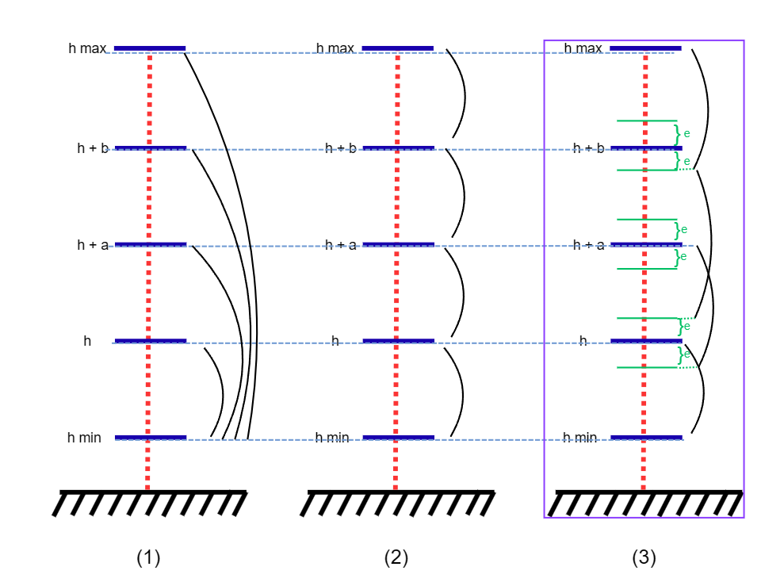
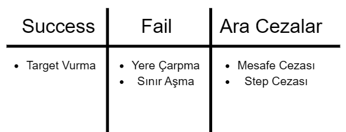
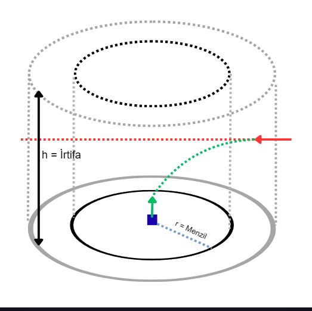
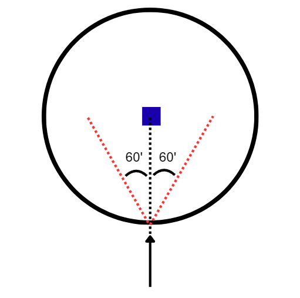
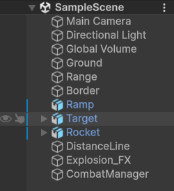
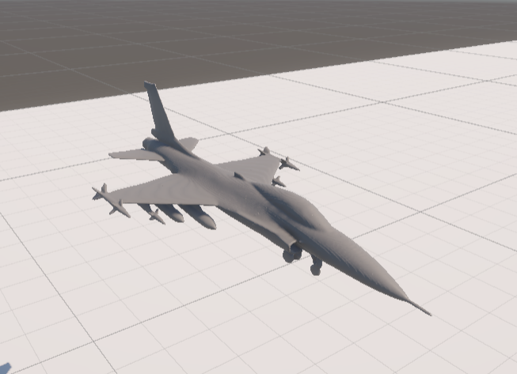
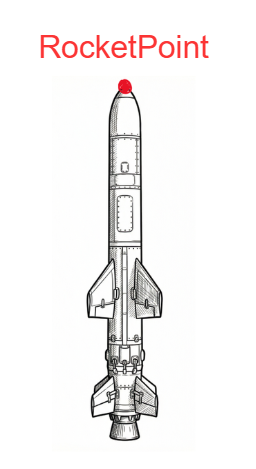
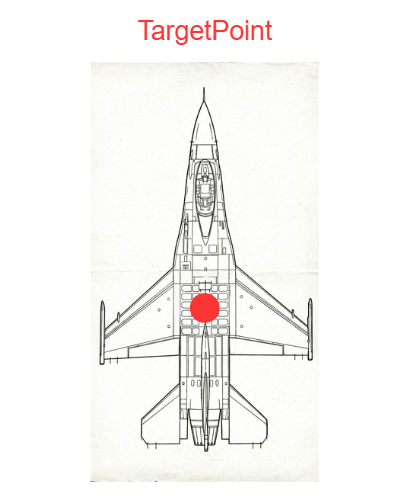
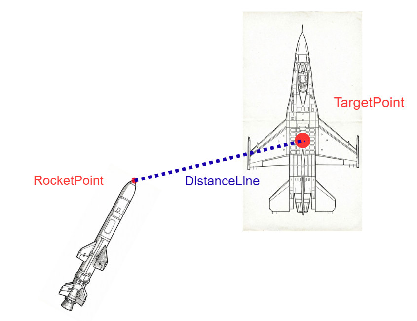

# ADS-AI Hava Savunma Sistemi

ADS-AI, Unity tabanlı bir fizik simülasyonu ve Python tabanlı bir Pekiştirmeli Öğrenme (Reinforcement Learning) ajanı kullanarak geliştirilen bir güdümlü roket simülasyon projesidir. Proje, bir roketin hava hedeflerini (F-16 vb.) hibrit bir güdüm-kontrol mimarisi ile takip edip vurmasını hedefler.


> [!NOTE]
> Proje şu an **çalıştırılabilir** durumdadır. Eğitim altyapısı PPO (Proximal Policy Optimization) üzerinden kurgulanmıştır.

---

## 🚀 Hızlı Başlangıç (Nasıl Çalıştırılır?)

Projenin senkronize çalışabilmesi için **önce Unity editörünün, ardından Python ortamının** başlatılması gerekir.

### 1. Unity Tarafını Hazırlama
1. `ads_ai` klasörünü Unity Hub ile açın.
2. `MainScene` (veya ilgili ana sahne) dosyasını açın.
3. **Play** tuşuna basın.
4. Unity tarafındaki `Env` scripti sunucu modunda port açıp (TCP üzerinden) dinlemeye başlayacaktır.

### 2. Python Tarafını Başlatma (Eğitim İçin)
1. Gerekli kütüphaneleri yükleyin:
   ```bash
   pip install tensorflow numpy
   ```
2. Eğitim sürecini başlatın:
   ```bash
   python scripts/train.py
   ```
3. Python ajanı Unity'ye (varsayılan olarak `127.0.0.1:5005`) bağlanacak ve eğitim döngüsü başlayacaktır.

### 3. Eğitilmiş Modeli Test Etme
Eğitim tamamlandığında veya belirli bir checkpoint'i test etmek istediğinizde Unity açıkken şu komutu çalıştırabilirsiniz:
```bash
python scripts/test.py
```
*Bu betik, kaydedilmiş en son modeli yükler ve ajanın rastgele keşif (exploration) yapmadan doğrudan karar vermesini (`Deterministic Policy`) sağlar. Konsol ekranında başarı oranını ve metrikleri özetler.*

---

## 🎯 Proje Mimarisi: Hibrit Güdüm-Kontrol

Proje, saf "uçtan uca" (end-to-end) RL yaklaşımı yerine daha kararlı olan **hibrit** bir yapıya evrilmiştir:
- **C# / Unity Katmanı:** Geometrik referans dönüşümleri, yerel koordinat sistemine geçiş ve fiziksel tork uygulaması burada yapılır.
- **Python / RL Katmanı:** Geometrik çerçeve üzerinden gelen anlamlı verileri (state) yorumlayarak itki (thrust) ve yönelim (pitch/yaw) komutlarının büyüklüğünü belirler.

### Müfredatlı Öğrenme (Curriculum Learning)
Eğitim sürecinde zorluk seviyesi kademeli olarak artırılır. Başlangıçta hedef, roketin kolayca ulaşabileceği düşük irtifalarda başlatılır ve başarı arttıkça irtifa/manevra zorluğu artırılır.



---

## 📊 Teknik Parametreler

### 5.1. Durum Uzayı (Observation Space - 20 Parametre)
Ajan, Unity'den gelen ham verileri `env.py` içinde parse edip normalize ederek kullanır. Veri sırası şöyledir:

| İndis | Parametre | Açıklama |
| :--- | :--- | :--- |
| 0-2 | `target_dir_x, y, z` | Roketten hedefe uzanan birim vektör (Yerel Eksen). |
| 3-5 | `rel_vel_x, y, z` | Hedefin rokete göre bağıl hızı. |
| 6-8 | `roc_vel_x, y, z` | Roketin kendi lineer hızı. |
| 9-11 | `roc_ang_vel_x, y, z`| Roketin açısal hızı (Salınım kontrolü için). |
| 12 | `roc_h` | Roketin anlık irtifası. |
| 13 | `target_h` | Hedefin anlık irtifası. |
| 14-16 | `gx, gy, gz` | Yerçekimi vektörünün roket yerel eksenindeki izdüşümü. |
| 17 | `distance` | Hedefe olan Öklid mesafesi. |
| 18 | `closing_rate` | Kapanma hızı (Uzaklığın zamana göre türevi). |
| 19 | `blend_w` | Guidance-RL geçiş ağırlığı. |


### 5.2. Aksiyon Uzayı (Action Space - 3 Parametre)
PPO ajanı `[-1, 1]` aralığında normalize çıktılar üretir. Bu çıktılar `env.py` içinde şu ölçeklere dönüştürülür:

- **Thrust:** `600 - 1000` birim arası sürekli itki.
- **Pitch Force:** Maksimum `1.5` birim tork (Dikey sapma).
- **Yaw Force:** Maksimum `1.5` birim tork (Yatay sapma).

> [!IMPORTANT]
> **Roll Kontrolü:** Eğitimi kolaylaştırmak adına ilk sürümde roketin kendi ekseni etrafındaki dönüşü (roll) Python tarafında komutlandırılmaz, Unity tarafında stabilize edilir.

### 5.3. Ödül Mekanizması (Reward Function)
Eğitim kararlılığı için `env.py` içindeki `calculate_reward` fonksiyonu şu ağırlıkları kullanır:
- **Adım Cezası:** `-0.02` (Hızlı bitirmeye teşvik).
- **Mesafe Kazancı:** Yaklaşılan her birim için ödül (Delta Distance * 0.5).
- **Başarı Ödülü:** `+200.0` (Mesafe < 12 birim ise).
- **İrtifa Cezaları:** Çok düşük (`<0.5`) veya çok yüksek (`>250`) irtifada ağır cezalar (`-100` / `-80`) ve terminal duruş.
- **Zaman Aşımı:** `-60.0` (1300 adımdan sonra).



---

## 🌍 Simülasyon Ortamı ve Başlangıç Koşulları

Simülasyon alanı dairesel bölgelerden oluşur:
- **Ground:** 1000m x 1000m operasyon alanı.
- **Target Spawn:** Hedef, merkezden 300m uzaklıkta ve +/- 60 derece yatay sapma ile başlatılır.




---
## 🛠️ Derinlemesine Modül Analizi ve Kod Yapısı

Sistem, Python tarafında bir **Sunucu (Server)** ve Unity tarafında bir **İstemci (Client)** mantığıyla, hibrit bir GNC (Guidance, Navigation, and Control) mimarisi üzerine kurulmuştur.

### 🐍 Python Kontrol Katmanı (`scripts/`)

#### 1. `agent.py` - PPO Mekanizması
`PPOAgent` sınıfı, Actor-Critic mimarisini yönetir.
- **`__init__`**: `state_size` (20) ve `action_size` (3) parametreleri ile Actor ve Critic ağlarını oluşturur.
- **`act(state)`**: Mevcut gözlem için bir aksiyon örneklemesi yapar, log-olasılığını ve değer tahminini (value) döndürür.
- **`train(...)`**: Toplanan rollout verilerini kullanarak `policy_loss`, `value_loss` ve `entropy_loss` hesaplar. PPO'nun "clipping" mekanizması burada uygulanarak gradyan güncellemelerinin çok büyük olması engellenir.

#### 2. `env.py` - RL Ortam Arayüzü
Unity ile Python arasındaki veri çevirici sınıftır.
- **`parse_state(raw_dict)`**: Unity'den gelen JSON paketini düz bir sayısal vektöre (20 eleman) dönüştürür.
- **`normalize_state(vector)`**: Fiziksel büyüklükleri (Hız, Mesafe, İrtifa) `[-1, 1]` aralığına ölçekler. Bu, sinir ağının daha hızlı yakınsaması (convergence) için kritiktir.
- **`calculate_reward(raw_state)`**: 
    - `DISTANCE_GAIN`: Hedefe her yaklaşma adımı için ödül verir.
    - `ALTITUDE_PENALTY`: Yere çok yakın uçuşları engellemek için `-100` puanlık terminal ceza uygular.
- **`denormalize_action(action)`**: Ajanın `[-1, 1]` çıktılarını gerçek `Thrust (600-1000)` ve `Torque (1.5)` değerlerine dönüştürür.

#### 3. `train.py` - Ana Eğitim Döngüsü
Eğitimin orkestra şefidir.
- **Rollout Toplama**: `ROLLOUT_LEN` (512) adım boyunca Unity'den veri toplar.
- **Checkpoint**: Her n güncellemede bir `.keras` (model ağırlıkları) ve `.pkl.gz` (ajan durumu) dosyalarını kaydeder.

#### 4. `test.py` - Model Değerlendirme Modülü
Eğitilmiş modelin performansını ölçmek ve görselleştirmek için kullanılır.
- **`load_test_checkpoint(...)`**: `models` dizinindeki en son (`latest`) veya manuel belirtilen bir `.keras` ağı ve `.pkl.gz` ajan durumunu yükler.
- **`Deterministic Policy`**: Test sırasında aksiyon seçimini rastgele olasılık dağılımı (sampling) yerine doğrudan en yüksek değerli (mean) hareketi seçerek (`tanh(mu)`) yapar.
- **Test Özeti**: Belirlenen bölüm (episode) sayısı kadar simülasyon koşturur ve sonunda `Success Rate`, `Mean Return`, `Mean Episode Len` gibi performans metriklerini yazdırır.

---

### 🎮 Unity Simülasyon Katmanı (`ads_ai/Assets/Scripts/`)

#### 1. `Env.cs` - Fizik ve Gözlem Yönetimi
Unity tarafındaki ana yönetim scriptidir. `IncomingPacket` ve `OutgoingPacket` sınıfları ile veri iletişimini standardize eder.
- **`FixedUpdate()`**: Unity fizik motoruyla senkronize çalışır. Python'dan gelen aksiyonları burada `ApplyAction()` ile Rigidbody üzerine uygular.
- **`CollectState()`**: Projenin en kritik geometrik dönüşüm fonksiyonudur:
    - `rocketPoint.InverseTransformDirection()`: Dünya koordinatlarındaki hedef vektörünü roketin "bakış açısına" (Local Frame) çevirir.
    - `closing_rate`: `prevDistance` ve `currentDistance` farkı üzerinden saniyedeki yaklaşma hızını hesaplar.
- **`ResetEnvironment()`**: Bölüm bittiğinde roketi fırlatma rampasına, hedefi ise dairesel bölgede rastgele bir noktaya ve rastgele bir heading açısına yerleştirir.

**Unity Hiyerarşisi:** Projenin Unity `Scene` hiyerarşisinde `CombatManager`, `Rocket` ve `Target` parent-child ilişkisi olmadan tamamen bağımsızdır.


| Sahne Genel Görünümü | Rampa ve Roket Detayı | Hedef Yakın Çekim |
| :---: | :---: | :---: |
|  |  |  |

#### 2. `Connector.cs` - Veri İletişim Protokolü
TCP tabanlı asenkron bir haberleşme sağlar.
- **JSON Serialization**: Unity'nin `JsonUtility` sınıfını kullanarak C# objelerini Python'ın anlayacağı metin formatına çevirir.
- **Length-Prefixed Framing**: Paketlerin başında 4-bytelık bir uzunluk bilgisi gönderilir. Bu, TCP akışında paketlerin birbirine karışmasını engeller (Framing problemi).

---

## 📐 Geometrik Hesaplamalar ve GNC (Guidance, Navigation, Control)

Doğru takip için roket ve hedef arasındaki geometrik ilişki `Env.cs` içindeki **`CollectState()`** fonksiyonu ile sürekli analiz edilir. Bu fonksiyon, dünya koordinatlarındaki hedef vektörünü roketin "bakış açısına" (Local Frame) çevirir ve kapanma hızını (`closing_rate`) hesaplar.

Takip algoritmaları aşağıdaki üç temel görsel değerlendirme (referans) noktası üzerinden çalışır ve hesaplanır:

- **RocketPoint Detayı:** Roket burnunun en uç kısmıdır, ölçümler buradan başlar.
- **TargetPoint Detayı:** Hedefin ağırlık merkezidir, kilitlenme bu noktaya yapılır.
- **DistanceLine (LOS):** Arayıcı başlığın gördüğü görüş hattıdır.

| RocketPoint (Ölçüm Noktası) | TargetPoint (Kilitlenme) | DistanceLine (Görüş Hattı) |
| :---: | :---: | :---: |
|  |  |  |

### Yönelim ve Sapma (Deflection)
Roketin hedeften ne kadar saptığını, gövde doğrultusu olan `ForwardLine` (bakış yönü) ve `DistanceLine` (hedef yönü) arasındaki açısal sapma (`Deflection angle`) belirler. RL ajanı, bu sapmayı minimize edecek tork komutlarını üretmeye çalışır.


*ForwardLine ve DistanceLine arasındaki açısal sapmanın (`Deflection angle`) görselleştirilmesi.*
## 📈 Gelecek Planları
- **Multi-Agent:** Birden fazla roketin koordineli çalışması.
- **Gelişmiş GNC:** Proportional Navigation (PN) yasasının RL ile tam entegrasyonu.
- **Curriculum Learning:** Hedef hızının ve manevra kabiliyetinin kademeli artırılması.

## 14. Loglama ve İzleme Altyapısı

Eğitim süreçlerinin şeffaf ve analiz edilebilir olması için kapsamlı bir loglama altyapısı tasarlanmıştır.

### 14.1. CSV Log Dosyaları

`log.py` modülü; adım, bölüm ve güncelleme seviyesinde CSV formatında log dosyaları üretir. Örnek alanlar:

- Zaman damgası, update kimliği, bölüm kimliği ve adım numarası  
- Mesafe, kapanma oranı, irtifa gibi durum bileşenleri  
- Ödül, bölüm sonu sebebi (`done_reason`) ve diğer tanılayıcı bilgiler

Bu sayede:

- Eğitim sürecindeki **öğrenme eğrileri** (örneğin ortalama ödül, bölüm uzunluğu) kolayca çıkarılabilir.  
- Farklı müfredat senaryolarının ve hiperparametre ayarlarının karşılaştırması yapılabilir.  
- Anomali durumları (aşırı dalgalanma, takılma vb.) tespit edilebilir.

### 14.2. Konsol Çıktıları

`log.py` ayrıca eğitim sırasında terminale düzenli özetler basar:

- Belirli her birkaç adımda: Mesafe, irtifa, kapanma oranı vb. metrikler  
- Her bölüm sonunda: Toplam ödül, bölüm uzunluğu, başlangıç ve bitiş koşulları  
- Her güncelleme sonunda: Loss bileşenleri (policy, value, entropy, KL vb.)

Bu çıktılar, uzun eğitimler sırasında süreci **gerçek zamanlı izlemenizi** kolaylaştırır.