# ADS-AI Roket Güdüm Projesi

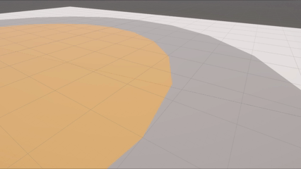

Bu proje, Unity fizik simülasyonu içinde hareket eden bir roketin yaklaşan bir hedefi vurmayı öğrenmesi için geliştirilmiş bir pekiştirmeli öğrenme ortamıdır. Unity tarafı fizik, sahne, hedef, roket ve telemetry verisini üretir. Python tarafı bu veriden durum vektörü çıkarır, ödül hesaplar, SAC ajanını eğitir ve Unity'ye action gönderir.

Güncel teslim noktası `v16.0.7_forward_speed_y100` fazıdır. Bu fazda PPO denemelerinden ve klasik güdüm testlerinden sonra SAC tabanlı, replay buffer kullanan, continuous action üreten bir eğitim hattı bırakılmıştır.

## Güncel Durum

Aktif final model:

```text
model_prefix: sac_v16_0_7_forward_speed_y100
selected_checkpoint: step 675000
selection_method: deterministic checkpoint sweep + Unity visual observation
validated_offsets: +3 and +5 valid intercept
visual_final_candidate: +5 offset
valid_intercept_rule: hit + closing >= -1.0 + theta <= 30 deg + alignment >= 0.866
target_y: 100 m
max_step: 1200
control_mode: direct_accel
```

Tüm run snapshot'ında success sinyali alınmış olsa da final seçim yalnızca ham success sayısına göre yapılmamıştır. Çünkü bazı checkpointlerde collider teması success üretse bile roketin hedefin altından ya da arkasından dolanarak vurduğu görülebilir. Bu yüzden final aday, ayrıca deterministik checkpoint sweep ile izlenmiştir. `step675000` checkpoint'i `-5, -3, +3, +5` offset testlerinde 4/4 hit vermiş; `+3` ve `+5` offsetlerinde `valid_intercept` koşulunu sağlamıştır. Unity gözleminde özellikle son test olan `+5` offset vuruşu daha temiz önden yaklaşma davranışı gösterdiği için final aday olarak seçilmiştir.

Seçilen checkpoint test özeti:

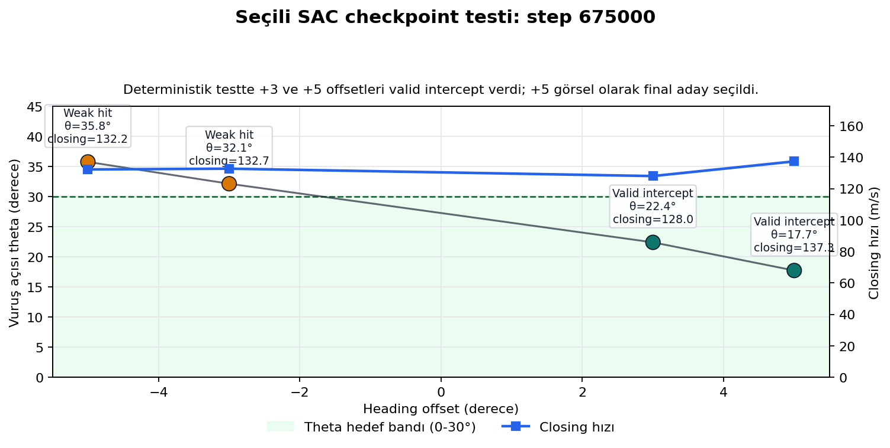

Final test komutu:

```powershell
conda activate rl_codes
python scripts/final_test.py
```

`final_test.py` Unity sahnesi açıkken seçilen `step675000` checkpoint'ini yükler ve kullanıcı durdurana kadar deterministik policy ile test episode'ları çalıştırır. Konsolda success, valid intercept, weak hit, missed intercept, timeout, episode uzunluğu, reward, theta, closing ve hit bilgisi kısa biçimde yazdırılır.

## Genel Faz Akışı

Proje tek hamlede bu noktaya gelmedi. Ana teknik geçiş şu şekildedir:

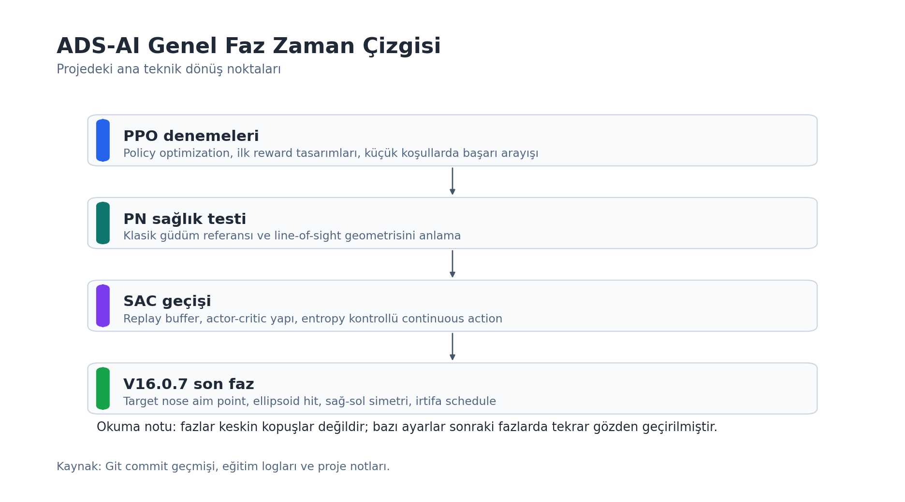

Kısa okuma:

- PPO ilk denemelerde küçük radius değerlerinde umut verdi, fakat büyük radius ve heading offset altında davranış genelleşmedi.
- PN / oransal güdüm fikri, problemin yalnızca reward değil aynı zamanda geometri ve simülasyon sağlığı problemi olduğunu gösteren referans olarak kullanıldı.
- SAC'a geçişin ana gerekçesi off-policy öğrenme, replay buffer ve continuous control için daha uygun keşif davranışıydı.
- V16.0.7'de hedef burnu çevresinde aim point, ellipsoid hit bölgesi, sağ-sol simetri, irtifa schedule ve ileri hız ayarları ile daha çalışır bir sonuç alındı.

## PPO'dan SAC'a Geçiş

PPO, on-policy bir algoritmadır. Yani her güncellemede son toplanan rollout verisini kullanır ve bu veri güncellemeden sonra büyük ölçüde eskir. Bu projede episode'lar pahalıdır; Unity fizik simülasyonu gerçek zamanlı çalıştığı için her transition değerlidir. Bu yüzden aynı deneyleri tekrar tekrar kullanabilen off-policy bir yöntem daha mantıklı hale geldi.

PPO'nun temel fikri policy oranını sınırlayarak çok sert güncellemeleri engellemektir:

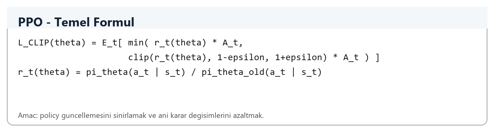

SAC ise replay buffer içindeki geçmiş deneyleri tekrar kullanır. Ayrıca entropy terimi sayesinde policy'nin eğitim sırasında aşırı erken tek davranışa çökmesini engellemeye çalışır:

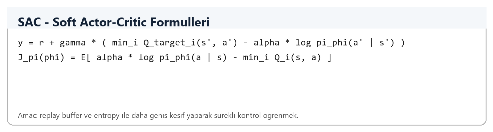

SAC'ın bu projedeki avantajları:

- `Replay buffer`: Başarılı ve başarısız geçmiş deneyler yeniden kullanılabilir.
- `Actor-critic`: Actor action üretir, critic bu action'ın uzun vadeli değerini tahmin eder.
- `Twin Q`: İki critic kullanarak değer tahminindeki aşırı iyimserliği azaltır.
- `Entropy`: Eğitim sırasında rastlantısal keşfi teşvik eder.
- `Continuous action`: Roketin sağ-sol, yukarı-aşağı ve ileri ivme bileşenleri doğrudan sürekli değerlerle temsil edilir.

PN formülü de proje boyunca "klasik güdüm mantığı ne söyler?" sorusu için referans olarak kullanıldı:

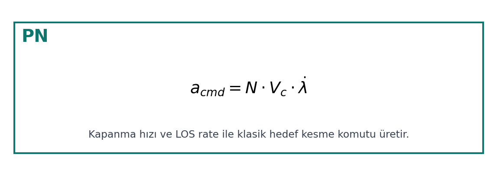

## SAC: Stokastik Train, Deterministik Test

SAC eğitim sırasında stokastik, yani rastlantısal action örnekler. Bu rastlantısallık hata değil, keşif mekanizmasıdır. Policy bir ortalama (`mu`) ve dağılım genişliği (`sigma`) üretir; eğitimde action bu dağılımdan örneklenir.

Test sırasında ise deterministik çalıştırılır. Yani gürültü kapatılır ve actor'ın ortalama action'ı kullanılır. Bu yüzden training ekranında roket daha oynak görünebilir; final testte aynı model daha sakin ve tekrarlanabilir davranır.

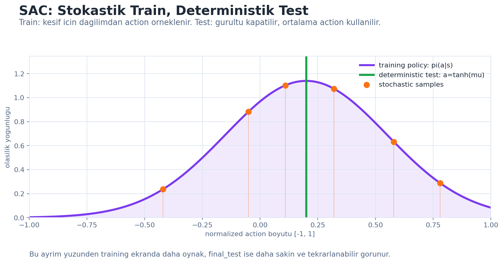

Pratik yorum:

- Eğitimde oynaklık kısmen normaldir.
- Deterministik test, modelin gerçekten öğrendiği merkezi davranışı gösterir.
- Başarılı bir checkpoint seçerken yalnızca son modeli ya da ham success sayısını değil, deterministik testteki gerçek yaklaşma geometrisini izlemek gerekir.

## Matematiksel Gözlem: Alignment ve Açı

Projede uzun süre tartışılan ana konulardan biri alignment ödülünün açıyla ilişkisi oldu. Alignment şu şekilde tanımlanır:

```text
alignment = cos(theta)
```

Burada `theta`, roket burnu ile hedef görüş hattı arasındaki açıdır. Bu değer açının kendisi değildir; cosinus dönüşümünden geçmiş bir hizalanma skorudur.

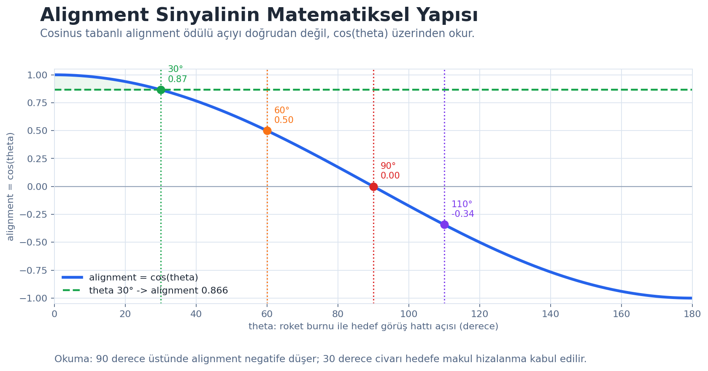

Bu grafik şunu anlatır:

- `theta = 0` iken alignment `1.0` olur, yani roket hedefe tam bakıyordur.
- `theta = 90` iken alignment `0` olur.
- `theta > 90` olduğunda alignment negatife düşer.
- `theta = 30` civarında alignment yaklaşık `0.866` olduğu için hedefe makul hizalanma kabul edilebilir.

Bir diğer önemli geometri problemi hedefin sabit irtifada yaklaşmasıdır. Hedef irtifası `h = 100 m`, yatay mesafe `x` kabul edilirse roketin görmesi gereken açı yaklaşık:

```text
theta(x) = atan(h / x)
|d theta / dx| = h / (x^2 + h^2)
```

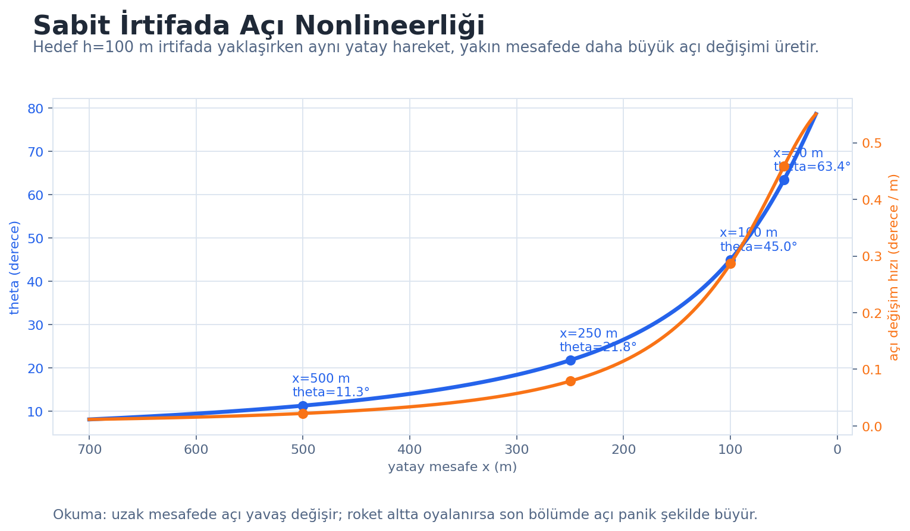

Bu grafik, neden roketin bazen alçak irtifada bekleyip son anda panik tırmanışına geçtiğini açıklar. Uzak mesafede hedefin açısı yavaş değişir; bu yüzden alignment sinyali "şimdilik sorun yok" gibi görünebilir. Hedef yaklaştıkça aynı yatay hareket çok daha büyük açı değişimi üretir. Bu nedenle yalnızca alignment'a güvenmek reward hacking riskini artırır; closing, final approach, step penalty ve irtifa schedule birlikte düşünülmelidir.

## Reward ve Terminal Mantığı

Güncel fazda reward karmaşık eski shaping denemelerine göre sade tutulmuştur. Ana amaç roketi şu davranışlara itmekti:

- Hedefe yaklaşmak.
- Görüş hattı açısını düşürmek.
- Hedefe göre doğru final yaklaşma geometrisini kurmak.
- Alçakta oyalanmayı azaltmak.
- Hedefin arkasına takılıp timeout ödülü toplamayı engellemek.

Temel bileşenler:

```text
step_penalty
distance_progress
theta_progress
lateral_alignment
altitude_schedule
closing
final_approach
terminal_reward
```

Başarı artık yalnızca basit mesafe hesabı gibi düşünülmez. Unity tarafındaki hedef hit alanı ve Python tarafındaki final telemetry birlikte okunur. V16'da hedef gövdesi etrafındaki ellipsoid hit bölgesi, "füze çok yakın patlayıp hasar verdi" yorumuna daha uygundur.

Terminal sebeplerinin son run snapshot'ındaki dağılımı:

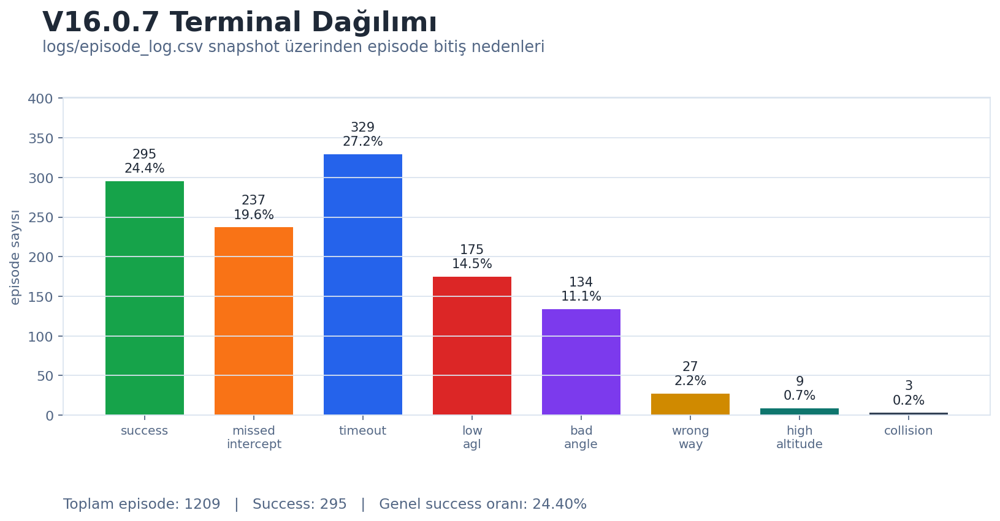

Okuma:

- `success` artık rastgele ya da wrapper kaynaklı değildir; zero/random baseline mantığı bu yüzden geçmişte ayrıca test edildi.
- `missed_intercept` ve `timeout`, hedefe yaklaşsa da doğru zamanda vuramayan episode'ları ayırmak için önemlidir.
- `low_agl`, `bad_angle`, `wrong_way` gibi terminaller roketin öğrenme alanını gereksiz kaçışlardan temizlemek için kullanılmıştır.

## Eğitim Grafikleri

Rolling success grafiği, modelin dönem dönem ciddi şekilde iyileştiğini ama eğitimin monoton artmadığını gösterir:

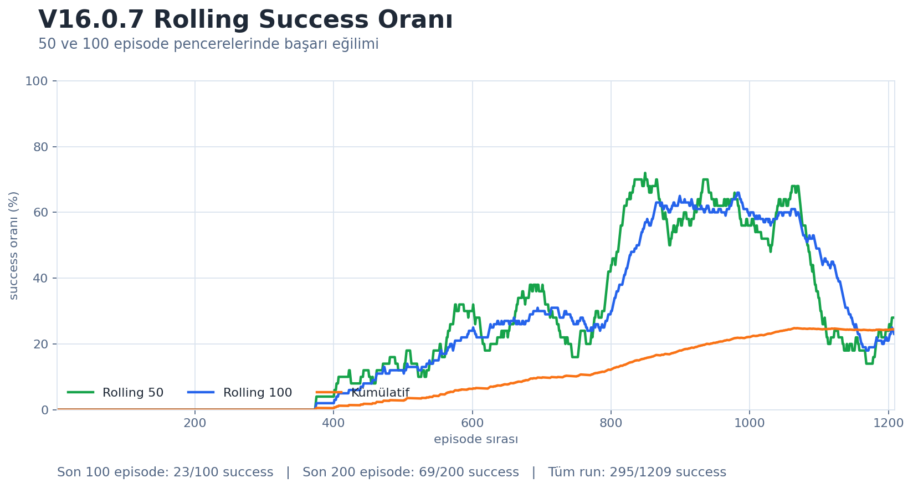

Success scatter grafiği episode sırasına göre başarıların nerede yoğunlaştığını gösterir. Bu grafik aday checkpoint aralığını daraltmak için kullanışlıdır; final karar ise ayrıca deterministik sweep ve görsel gözlemle verilmiştir:

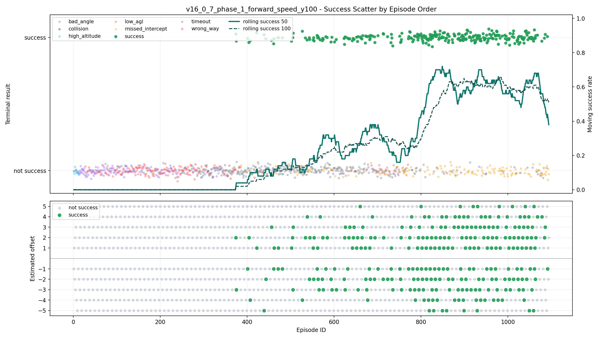

Final distance ve theta trendi, roketin zamanla hedefe daha yakın bitirmeyi ve daha düşük açıyla yaklaşmayı öğrendiğini gösterir:

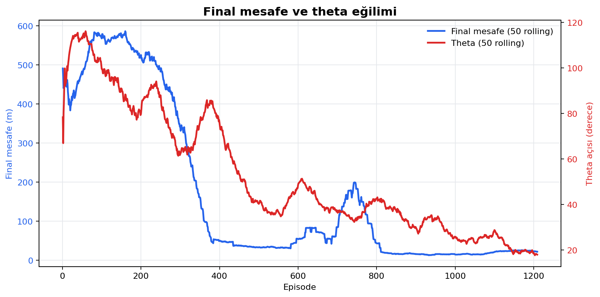

SAC update log grafiği alpha, entropy ve value loss davranışını gösterir:

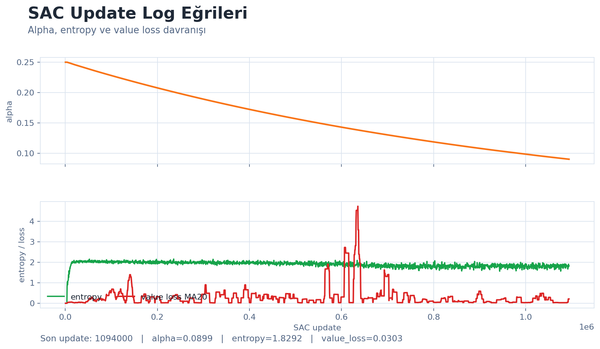

Kısa yorum:

- Alpha azalırken policy daha az rastlantısal hale gelir.
- Entropy tamamen sıfırlanmaz; bu SAC'ın keşif baskısını koruduğunu gösterir.
- Value loss spike'ları, replay buffer içindeki yeni davranış bölgeleri ve reward değişimlerinin critic tarafından sindirildiği dönemleri işaret eder.

## Arayüz ve Sahne Görüntüleri

Unity runtime görünümü aşağıdaki çoklu kamera ekranında gösterilmiştir. Bu görüntü roket, hedef uçak, takip çizgileri ve sahnedeki test düzenini aynı anda okumak için kullanılır.

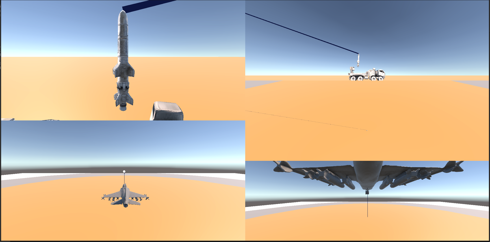

Aim point ve hit ellipsoid sahne içinde ayrıca görselleştirilmiştir. Büyük yarı saydam elipsoid hedef etrafındaki yakın patlama / hasar bölgesini, küçük küre ise roketin yönelmesi beklenen aim point'i temsil eder.

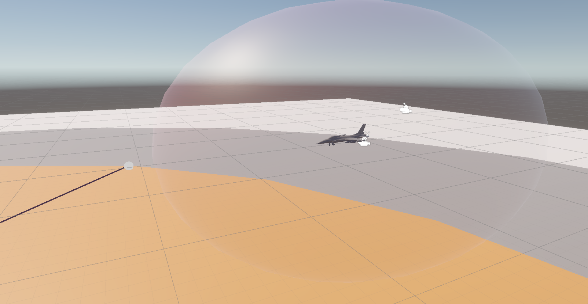

## Çalıştırma

1. Unity projesini aç:

```text
ads_ai/
```

2. Unity sahnesinde Play'e bas.

3. Python ortamını aç:

```powershell
conda activate rl_codes
```

4. Final modeli test et:

```powershell
python scripts/final_test.py
```

5. Sadece seçilen checkpoint'i yavaş ve gözlemlenebilir biçimde test etmek istersen:

```powershell
python scripts/test_selected_checkpoint.py
```

6. Eğitimi devam ettirmek istersen:

```powershell
python scripts/train.py
```

7. Grafik üretmek istersen:

```powershell
python scripts/generate_readme_charts.py
python scripts/plot_success_scatter.py
python scripts/plot_sac_report.py
```

## Klasör Yapısı

```text
ads_ai/
  ads_ai/                       Unity projesi
    Assets/Scripts/Env.cs       Unity fizik, action uygulama ve telemetry
    Assets/Scripts/Connector.cs TCP/JSON iletişim katmanı
    Assets/Scenes/              Unity sahneleri

  scripts/                      Python RL kodları
    train.py                    Aktif SAC training döngüsü
    final_test.py               Final checkpoint test scripti
    test_selected_checkpoint.py Seçili step675000 checkpoint'i için gözlem testi
    checkpoint_sweep_test.py    Checkpoint adaylarını offset bazlı deterministik test eder
    sac_agent.py                SAC actor, critic, replay buffer ve checkpoint
    env.py                      Python Env wrapper, reward ve state/action dönüşümü
    settings.py                 Model prefix, SAC ayarları, GPU/port ayarları
    connector.py                Unity-Python TCP bağlantısı
    cuda_bootstrap.py           Windows/Conda CUDA DLL hazırlığı
    log.py                      CSV ve terminal logları
    generate_readme_charts.py   README grafiklerini Türkçe karakter desteğiyle üretir
    plot_success_scatter.py     Success scatter ve rolling success grafiği
    plot_sac_report.py          SAC eğitim rapor grafikleri

  docs/readme_assets/           README görselleri
  logs/                         Güncel eğitim logları
  models/                       Final SAC checkpoint dosyaları
  CHANGELOG.md                  Kronolojik geliştirme notları
  VERSION                       Aktif sürüm bilgisi
```

`archives/` ve `teacher_data/` klasörleri yerelden kaldırılmıştır. Eski fazlar, teacher/pretrain denemeleri ve audit scriptleri Git commit geçmişinde durur; final çalışma klasöründe yalnızca aktif teslim hattı bırakılmıştır.

## Uzman İncelemesi İçin Öncelikli Noktalar

Bir uzmanın özellikle şu dosyalara bakması yeterli olur:

```text
scripts/env.py
scripts/sac_agent.py
scripts/train.py
scripts/settings.py
ads_ai/Assets/Scripts/Env.cs
ads_ai/Assets/Scripts/Connector.cs
```

Kontrol edilmesi gereken ana başlıklar:

- `alignment = cos(theta)` sinyalinin tek başına reward hacking üretip üretmediği.
- Closing ve final approach bileşenlerinin timeout'a değil intercept'e yönlendirip yönlendirmediği.
- Aim point ile hit ellipsoid'in Unity sahnesindeki konumu.
- Sağ-sol offset simetrisi ve replay mirror davranışı.
- SAC alpha/entropy eğrisinin exploration'ı yeterli ama aşırı olmayacak düzeyde tutup tutmadığı.
- Final checkpoint seçiminin ham success yerine valid intercept ve görsel yaklaşma kalitesine göre doğru olup olmadığı.

## Kısa Sonuç

Proje artık yalnızca deneme kodlarından oluşan dağınık bir çalışma değildir. Unity sahnesi, Python SAC hattı, final test scripti, seçilmiş checkpoint ve rapor grafikleri ile çalıştırılabilir bir teslim paketidir. Final aday `step675000` checkpoint'idir; bu seçim rolling success değerinden çok deterministik checkpoint sweep, valid intercept ölçütü ve Unity görsel gözlemiyle yapılmıştır.

Kalan temel teknik risk, modelin tüm spawn ve offset koşullarında tamamen kararlı bir güdüm kanunu öğrenmiş olmamasıdır. Buna rağmen PPO dönemine kıyasla SAC ile replay buffer, entropy kontrollü keşif ve final checkpoint seçimi sayesinde ölçülebilir bir başarı penceresi elde edilmiştir.
