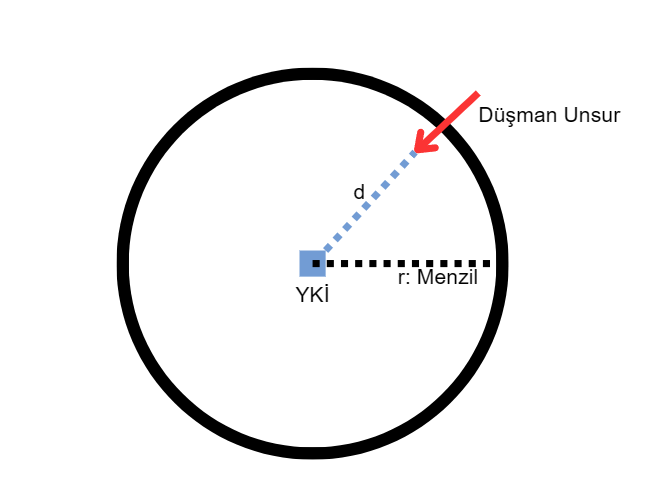
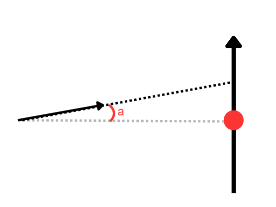
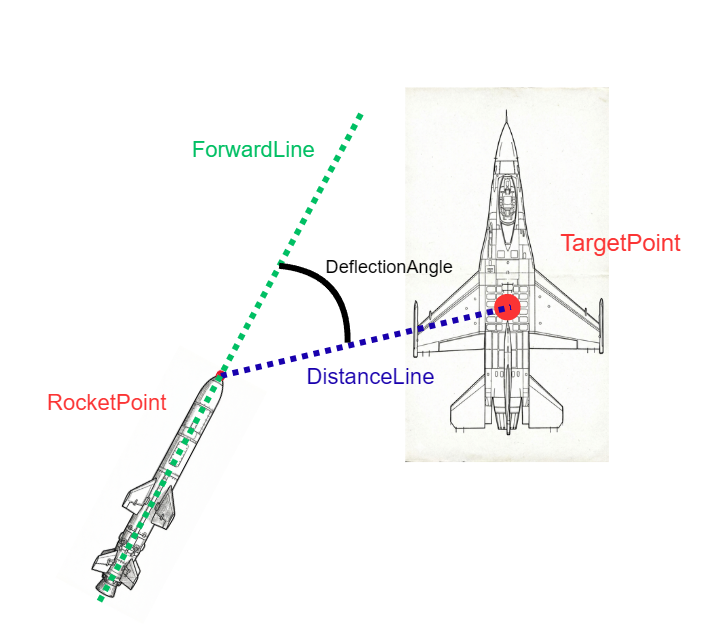

# ADS-AI Hava Savunma Sistemi (Geliştirme Aşamasında)

## 📖 Proje Özeti

ADS-AI, Unity tabanlı bir fizik simülasyonu ve Python tabanlı Pekiştirmeli Öğrenme (Reinforcement Learning - RL) ajanı kullanılarak geliştirilen deneysel bir güdümlü roket simülasyon projesidir. Proje, bir roketin hava hedeflerini (F-16 vb.) hibrit bir güdüm-kontrol mimarisi ile otonom olarak takip edip vurmasını hedeflemekte olup, **geliştirme ve stabilizasyon çalışmaları halen devam etmektedir.** 

Sistem, saf "uçtan uca" (end-to-end) bir RL yaklaşımından ziyade, geometrik ve fiziksel referansların C# katmanında işlendiği ve karar mekanizmasının Python katmanında (PPO algoritması) çalıştığı **hibrit** bir yapıya sahiptir. Ajan, hedefi bulmak için kademeli olarak zorlaşan bir **Müfredatlı Öğrenme (Curriculum Learning)** sürecinden geçmektedir.



> [!WARNING]  
> Proje henüz nihai başarılı sonuca ulaşmamıştır. Karar mekanizmaları ve eğitim süreci (PPO algoritması üzerinden) üzerinde test ve iyileştirme çalışmaları aktif olarak sürmektedir. Mevcut haliyle kodlar çalıştırılabilir olsa da elde edilen sonuçlar gelişim aşamasındadır.

---

## 🚀 Hızlı Başlangıç (Nasıl Çalıştırılır?)

> [!IMPORTANT]
> Projenin senkronize çalışabilmesi için **kademeli bir çalıştırma sırası izlenmesi mecburidir:**
> 1. Önce Unity editöründe proje "Play" edilir. 
> 2. Sonrasında Python arayüzünde model başlatılır. 
> Bu süreç sayesinde Python ajanı, ayağa kalkmış olan Unity TCP sunucusuna başarıyla bağlanır.

### 1. Python Kurulumu ve Kütüphane Versiyonları (Windows GPU Desteği İçin)
Windows ortamında Tensorflow'un GPU desteğinden (CUDA) sorunsuz ve doğrudan faydalanabilmek için projenin **Python 3.7.16** sürümüyle çalıştırılması zorunludur. Bunun için `Miniconda` kullanılması tavsiye edilir.

1. Miniconda ile özel bir sanal çevre oluşturun ve aktif edin:
   ```bash
   conda create -n ads_ai python=3.7.16
   conda activate ads_ai
   ```
2. Gerekli kütüphaneleri tam uyumlu ve spesifik sürümleriyle yükleyin (TensorFlow 2.10.x, Windows Py3.7'de yerel GPU destekleyen son resmi sürümdür):
   ```bash
   pip install tensorflow==2.10.0 numpy==1.21.6 pandas==1.3.5 pydantic==1.10.8
   ```

### 2. Uygulamanın Başlatılması 
**ADIM 1: Unity Tarafını Hazırlama ve Bekletme**
1. `ads_ai` klasörünü Unity Hub ile açın.
2. `SampleScene` (veya `MainScene`) dosyasını açın.
3. **Play** tuşuna basarak simülasyonu başlatın.
4. Unity tarafındaki `Env` scripti sunucu modunda port açıp bağlantı dinlemeye başlayacaktır (TCP 5005).

**ADIM 2: Python Tarafını (Eğitimi) Başlatma**
1. Terminalde conda ortamınızın (`ads_ai`) açık olduğundan emin olun.
2. Unity şu an aktif Play modunda olduğu için eğitim sürecini çalıştırabilirsiniz:
   ```bash
   python scripts/train.py
   ```
3. Ajan bağlandıktan sonra simülasyon adımları akmaya başlar. Eğitim ilerlemesi konsol üzerinden loglarla izlenebilir.


### 3. Eğitilmiş Modeli Test Etme
Eğitim tamamlandığında (veya mevcut model checkpoint'lerini denemek için) Unity play modundayken şu komutu çalıştırabilirsiniz:
```bash
python scripts/test.py
```
*Bu betik, kaydedilmiş en son (`latest`) modeli yükler ve ajanın rastgele keşif (exploration) yapmadan doğrudan karar vermesini (`Deterministic Policy`) sağlar. Konsol ekranında başarı oranını listeler.*

---

## 🎯 Proje Mimarisi ve Detaylı İşleyiş

Sistem, iş mantığını iki ana kata bölmüştür:

### Python Kontrol Katmanı (`scripts/`)
- **`agent.py`**: Actor-Critic mimarisiyle çalışan PPO mekanizmasını yönetir. Eğitim ağları burada oluşturulur ve hesaplanır.
- **`env.py`**: Unity ile RL ajanı arasındaki çevirici köprüdür. Gelen JSON verilerini normalize eder, PPO eylemlerini fiziksel komutlara dönüştürür. Sistemin en önemli bloğu olan dengeleyici **ödül fonksiyonu (`calculate_reward`)** burada bulunur.
- **`train.py` / `test.py`**: Ajanın modelini eğiten, güncelleyen ve kayıt altına alan ana döngü betikleridir.
- **`log.py`**: Eğitim verilerini, epizodik kayıtları, değer kayıplarını CSV dosyalarına ayrıştırır ve konsola renkli metrik bilgileri basar.

### Unity Simülasyon Katmanı (`Assets/Scripts/`)
- **`Env.cs`**: Simülasyon dünyasının kalbidir. Manuel fizik adımları (`Physics.Simulate`) ile dünyayı gerçek zamanlı günceller. AGL (yerden yükseklik kontrolü), mesafe ve objeler arası izafi hızlar gibi durum verilerini toplar. Python'dan aldığı tork/güç talimatlarını RigidBody'e uygular.
- **`Connector.cs`**: TCP tabanlı haberleşmeyi (JSON serileştirme ve Framing yapılarıyla) kesintisiz sağlar.
- **`CameraFollow.cs`**: Roketi gecikme olmadan eşzamanlı izleyen kamera denetim betiğidir.

---

## 📊 Teknik Parametreler

### Durum Uzayı (Observation Space - 20 Parametre)
Modelin karar vermek için Unity'den aldığı anlık durum girdileri `[-1, 1]` aralığında filtrelenerek ağa beslenir.

| İndis | Parametre | Açıklama |
| :--- | :--- | :--- |
| **0-2** | `target_dir_x, y, z` | Roketin hedefe olan yönelim vektörü (yerel (Local) eksenlerde hesaplanır). |
| **3-5** | `rel_vel_x, y, z` | Hedefin rokete göre bağıl (göreceli) hızı. |
| **6-8** | `roc_vel_x, y, z` | Roketin kendi lineer yerel hareket hızı. |
| **9-11** | `roc_ang_vel_x, y, z`| Roketin anlık açısal hızı (Aşırı savrulmaları cezalandırmak için ölçülür). |
| **12** | `roc_h` | Raycast ile hesaplanmış roketin anlık irtifası (`AGL` - Yerden yükseklik). |
| **13** | `height_error` | İzni verilen hedef yüksekliği ve anlık irtifa arasındaki mutlak hata payı. |
| **14-16** | `gx, gy, gz` | Uzayda yön bulmak adına yerçekiminin yerel eksendeki izdüşümü. |
| **17** | `distance` | Hedefe kalan mutlak Öklid mesafesi. |
| **18** | `look_angle_rad` | Roketin hedefi görme / hedefe bakış açısının radyan cinsi değeri. |
| **19** | `time_remaining` | Kalan eğitim step / adım süresi oranı. |

### Aksiyon Uzayı (Action Space)
Ajanın çıkardığı eylemler, 3 sürekli parametreden oluşur:
- **Thrust (Motor İtkisi):** Z eksenindeki sürekli itki kuvveti (580 - 1050 N arası modüleli).
- **Pitch Force (Yunuslama):** Dikey sapma için maksimum 1.7 tork limiti.
- **Yaw Force (Sapma):** Yatay sapma için maksimum 1.7 tork limiti.
*(Not: Roll (Kendi ekseninde rotasyon), öğrenme eğrisini sadeleştirmek adına ortam (Unity) tarafından kontrol edilir.)*



### Ödül Dağılımı ve Cezalar (Reward Function)
Agent, dengeli bir yönelim stratejisine kurgulanmıştır:
- **Hizalama (Angle Gain):** Uçuşun merkezidir, burun hedefe çevrildikçe alınan sürekli bonus.
- **Mesafe/İrtifa Senkronizasyonu:** Roket hedefe yaklaşırken, hedefin irtifasına göre pozisyonlanırsa ekstra kazançlar sağlanır.
- **Mekanik Cezalar:** Gereksiz manevralar ve takla atan rotasyonlar açısal hız cezası (`ang_vel_penalty`) ile caydırılır.
- **İrtifa ve Kaçış Terminal Capping:** Alt (`MIN_AGL`) veya üst (`MAX_ALTITUDE`) uçuş duvarlarını oymak ve simüle hedef alandan kaçmak terminal bir ceza (Episode biter ve eksi puan alır) sebebi sayılır.



---

## 📅 Kronolojik Proje Gelişim Geçmişi (CHANGELOG Özeti)

Projemiz, stabil bir hava savunma modeli elde edebilmek adına, ilk günden bugüne "Müfredatlı Öğrenme" modelinden beslenen adımlar kaydetmiştir.

### Temel Sistem ve Mimari Entegrasyon (v1.x Sürümleri)
- **v1.0 & v1.1:** Unity ortamı ile Python PPO eğitim modülleri sıfırdan birleştirildi. İlk başlarda Unity fizik aksaklıkları oluyordu; bu yüzden Unity `Env` ortamında manual bir `Physics.Simulate` senkronuna geçildi. Yerden yükseklik (`AGL`) ve Grounded tanımları sisteme güvenli reset mekanikleri ekledi.
- **v1.2:** Kamera takip esnekliği kaldırılarak (damping sıfırlanarak) roket davranışındaki ani bozulmalar görsel olarak transparan izlenebilir konuma getirildi. Rapor ve loglama mekanizması alt klasör formatlarına dağıtıldı.

### State Uzayı Kesinleşmesi (v2.x Sürümleri)
- **v2.0 İrtifa Hatası Güncellemesi:** RL ajanına mutlak hedef irtifasını vermek yerine, yükseklik fark aralığı (`height_error`) sağlandı. Böylelikle model gereksiz mutlak pozisyon yerine aradaki farkla ilgilenir hale geldi. `MIN_AGL` gibi ceza irtifası barajları yükseltilerek ajanın güvenli süzülmesi sağlandı.

### Ödül Mekanizmaları Devrimi ve Sınırların Genleşmesi (v3.x Sürümleri)
- **v3.0 ve v3.1:** Model rotasyon ve konum sapmaları yaşadığından state yapısına **`time_remaining`** ile zaman bilinci eklendi. Hedef etrafında sonsuza kadar savrulmak **Kaçış Terminali** ve ağır cezasıyla (`-50.0`) durduruldu.
- **v3.3 ve v3.4:** Performans sınırları yukarı çekildi (Max torklar 1.5'ten 1.7'ye esnetildi, yunuslama payı yükseldi). Yer ile temas ihtimallerine karşı (5 metre aşağısında) "Soft Floor" cezalandırma sistemi kurularak ajanın yere yaklaşımı kademeli olarak sertleştirildi.
- **Analiz Betikleri:** Modelleri ölçmek adına `docs/analiz.py` ve `scripts/reward_test.py` gibi dış araçlar entegre edildi.

### Müfredatlı Öğrenmenin (Curriculum Learning) Başlaması (v4.0 Sürümleri)
- Ajanın aşırı zorlandığı fark edildi. Hedef başlangıçta hareketsiz kılındı (`TARGET_VELOCITY=0`) ve sadece roketin üstünde dairesel şekilde (koordinat 0,0) konumlanarak modelin temel manevraları ve dengeyi safça öğrenmesi sağlandı.

### Gelişmiş State'ler ve Zorunlu Ölçeklendirme (v5.0 ve Fazlar Dönemi)
- **v5.0 Look Angle:** Kapanma hızı (`closing_rate`) state'i çıkartıldı, yerine ajanın hedefe hangi radyanda baktığını gösteren `look_angle_rad` state girdisi olarak sağlandı. Bununla bağlantılı pozitif yönde bir Angle Gauge ödül çarpanı atandı.
- **Faz 1'den Faz 9'a Detaylı Gelişim Çizgisi (Curriculum Learning):**
  Ajanın görev karmaşıklığını sistematik olarak artırmak için aşağıdaki 9 eğitim fazı tamamlanmıştır:

  - **Faz 1:** Hedef sabit ve roketin tam tepesindeydi (`TARGET_VELOCITY = 0.0`). Roketin başlangıç konumu hep merkez kabul edildi (`px, pz, ry, rz = 0`). Temel itki ve burun yönlendirme (hizalama) yetenekleri test edildi.
  - **Faz 2:** Hedefin dinamik başlatılması ilk defa devreye alındı. Hedef çok yakın (0-2 birim mesafede) alanda rastgele noktalarda oluşturularak temel takipten ziyade hedef yönelim adaptasyonu sağlandı.
  - **Faz 3:** Hedefin başlangıç mesafesi bir miktar genişletilerek 1-4 birim (daha geniş yakın alan) aralığına çıkartıldı. Model bu mesafede stabilize edildi.
  - **Faz 4:** Görev zorlaştırılarak hedefin doğabileceği yarıçap alanı 2-6 birime çıkarıldı. Orta mesafe takip reaksiyonları gelişti.
  - **Faz 5:** Hedef başlangıç alanı 3-9 birim aralığına genişletildi. Ajan, hem yönünü bulmayı hem de daha uzun süzülüşleri kavramaya başladı.
  - **Faz 6:** Eğitimin ufkunu genişletecek 4-10 birim aralığı tanıtıldı. Ajan, yüksek irtifayı kaybetmeden uzak hedeflere kaymayı optimize etti.
  - **Faz 7:** Başlangıç mesafesi 7-12 birim bandına çekilerek "uzak angajman" senaryolarına resmen geçiş yapıldı. Artan zorlukla başa çıkmak için sistem desteklendi: Ajanı rotasında tutacak `ANGLE_GAIN` 0.22'den 0.30'a çıkartıldı; uçuş başarılı olduğunda alınacak ana ödül de (`SUCCESS_REWARD`) 210'dan 250'ye yükseltildi. Öte yandan yüksek irtifa cezaları ve hedeften kaçış (`ESCAPE_PENALTY`) cezaları katılaştırıldı.
  - **Faz 8:** Hedef menzili iyice öteye (yaklaşık 7-13 birim minimum uzaklığa) taşındı. Ajan uzak mesafe angajman karakteristiğine oturdu.
  - **Faz 9:** Simülasyonun en ileri, zorlu eğitim senaryosuydu. Başlangıç mesafe alanı minimum 9 birim, maksimum 16 birim olacak kadar devasa ölçeklere oturtuldu. Yanı sıra, ajanın oyalanmasına engel olmak için "Step Ceza Sistemi" (`STEP_PENALTY`) daraltıldı (`-0.018` -> `-0.022`). Bu zorlaşmanın karşılığında, ajanın hedefe bakma başarı oranı ödülü (`ANGLE_GAIN`) `0.40` gibi yüksek bir limite çıkartıldı ve mesafe ödülleri iyileştirildi. 

  **Mevcut durumda, model belli bir olgunluğa (Faz 9) erişmiş olsa da; tam otonom ve kusursuz bir av-avcı reaksiyonu elde etmek için hiperparametre optimizasyonu, farklı faz denemeleri ve stabilizasyon çalışmaları aktif olarak devam etmektedir.**