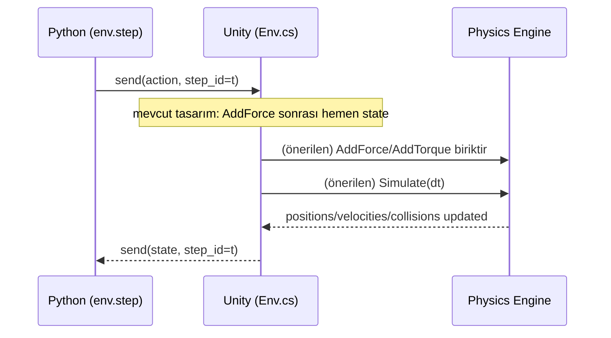

# Unity + RL Roket Projesi: Rampada Takılma ve Ortam Tutarsızlığı İncelemesi

## Yürütücü özeti

Bu projede görülen iki ana semptom — **(a) roketin rampada/başlangıçta “takılı kalması”** ve **(b) ortamın zamanla “tutarsız” davranması (özellikle Python tarafında eğitim/update sırasında)** — büyük ölçüde **adım (step) senkronizasyonunun gerçek-zamanlı Unity simülasyonuyla uyumsuz olmasından** kaynaklanıyor.

Mevcut mimaride Unity, **Python’dan yeni aksiyon gelmese bile** fizik ve hedef hareketini **FixedUpdate döngüsünde** sürdürmeye devam ediyor (Env.cs `FixedUpdate()` içinde hedef hareketi aksiyondan bağımsız çalışıyor). Python tarafında PPO güncellemesi (model train) birkaç yüz ms–saniye sürebildiğinde Unity sahnesi bu esnada “boşta” çalışıyor; roket **son aksiyonla veya yerçekimiyle** rastgele bir duruma sürükleniyor, Python tekrar aksiyon gönderdiğinde artık “eski gözlem” ile “gerçek fizik durumu” arasındaki bağ kopmuş oluyor. Bu kopuş, **rampada yatma / sürtünmeyle yapışma / düşük irtifaya düşme** gibi görüntülerle “roket takıldı” şeklinde hissediliyor.

İkinci kritik nokta gözlem hattında: `roc_h` Unity’de **rocketPoint’ın dünya Y koordinatı** olarak gönderiliyor (Env.cs `CollectState()`), bu da “yerden yükseklik” değil; rocketPoint, roketin lokal ekseninde bir offset olduğu için `roc_h` başlangıçta bile beklenenden yüksek/şaşırtıcı görünebiliyor. Örneğin sahnede `rocketPoint` lokal `z=0.3776` iken roket `x=-90°` döndürülmüş; bu durumda `rocketPoint` **dünya Y’ye** ~0.3776 m kadar eklenir. Bu nedenle “roket çarptı ama low_altitude sonra geldi” gibi çelişkiler oluşur.

Önerilen ana çözüm: Unity tarafını **tam senkron adım** mantığına geçirmek (manual physics step). `Physics.Simulate()` ile her Python aksiyonu için **tam 1 fizik adımı** ilerletmek ve **state’i simülasyondan sonra** göndermek. Unity dokümantasyonu, `AddForce` etkisinin “bir sonraki simülasyon çalıştırmasında” uygulandığını net söyler; dolayısıyla state’i `AddForce`’tan hemen sonra (simülasyon koşmadan) göndermek gözlemi geciktirir. citeturn0search12 Ayrıca `Rigidbody.position` ile reset atınca Transform’un “bir sonraki fizik adımından sonra” güncellenebileceği belirtilir; reset sonrası hemen state göndermek başlangıç gözlemini de bozabilir. citeturn2search11

Bunlara ek olarak: **çarpışma bayrağı / yerden gerçek yükseklik (AGL) raycast’i** ekleyip terminal koşulu (done) mantığını güçlendirmek, `closing_rate`’i mesafe farkından değil **LOS doğrultusunda hız projeksiyonundan** hesaplamak ve VS Code tarafında conda interpreter seçimi/run tuşu için `.vscode` ayarlarını netleştirmek gerekir. citeturn0search3turn0search11

## Depo yapısı ve kritik dosyalar

Bu analiz, konuşmada paylaşılan dosyalara dayanır (Unity prefab’ları, ProjectSettings ve `.vscode/*.json` dosyaları bu pakette yok). Elimdeki dosyalar:

- Unity/C#: `Env.cs`, `Connector.cs`, `CameraFollow.cs`, `scene.txt` (Unity sahnesinin YAML dump’ı)
- Python: `env.py`, `connector.py`, `agent.py`, `train.py`, `settings.py`, `log.py`, `test.py`

Aşağıdaki tablo “dosya → rol → risk/inceleme odağı” haritasını verir:

| Dosya | Rol | Kritik risk / inceleme odağı |
|---|---|---|
| `Env.cs` | Unity ortam yöneticisi; TCP’den reset/action alır, Rigidbody’ye uygular, state üretip Python’a yollar | **Senkronizasyon sorunu** (Update/FixedUpdate adım sırası), state’in fizik koşmadan gönderilmesi, reset sonrası state, çarpışma/AGL yok |
| `Connector.cs` | Unity TCP server; length-prefix JSON | `DataAvailable` ile okuma ve bloklama riskleri; paket bütünlüğü; log spam |
| `scene.txt` | Sahne nesneleri/parametreleri (Env MonoBehaviour inspector değerleri dahil) | RocketPoint offset’i, rocketResetPosition, targetSpeed gibi “gerçek koşum parametreleri” burada |
| `env.py` | Python RL ortam sarmalı; reset/step; reward+done hesaplar; state normalize eder | Done sadece `roc_h` eşiğine bağlı; Unity drift varsa “gözlem ≠ gerçek sim”; state tanımıyla C# uyumu |
| `connector.py` | Python TCP client; length-prefix JSON | Senkron step’in bloklayıcı beklentisi; timeouts yok |
| `agent.py` | PPO policy/value ağları ve eğitim adımı | State boyutu/ölçek değişirse model uyarlanmalı |
| `train.py` | Rollout toplama ve PPO update döngüsü | PPO update anında Unity’nin “boşta” akması drift yaratır |
| `settings.py` | IP/port, rollout_len, checkpoint | Eğitim süresi uzadıkça drift daha görünür |
| `log.py` | CSV/console loglama | Aşırı log + Unity log spam performans/jitter |
| `CameraFollow.cs` | Kamera takibi | Doğrudan “takılma” nedeni değil |
| `test.py` | Test/deneme sürücüleri | Senkron step doğrulama testleri buraya eklenebilir |

Eksik ama istenen (bu raporun sonunda kısa liste olarak tekrar isteyeceğim): `.vscode/launch.json`, `.vscode/settings.json`, Unity `ProjectSettings/Physics*` ve `TimeManager` dosyaları, ramp prefab’ı ve physic material bilgisi.

## Durum uzayı ve gözlem hattı

### Mevcut state vektörü ve kaynakları

Python tarafı state’i 20 boyutlu vektör yapıyor (`env.py` `state_size=20`, `parse_state()`), Unity tarafı bu alanları `OutgoingStateData` ile JSON’a yazıyor (`Env.cs` `CollectState()`). Alanlar:

1) **`target_dir` (3)**  
- Unity: `toTarget = targetPoint.position - rocketPoint.position; targetDirWorld = toTarget / distance;` sonra `useLocalFrame` ise `rocketPoint.InverseTransformDirection(targetDirWorld)` (Env.cs `CollectState()`).  
- Python: `parse_state` ile vektöre `[0:3]`.

2) **`rel_vel` (3)**  
- Unity: `targetVelWorld = targetMoveDir * targetSpeed; relVelWorld = targetVelWorld - rocketRb.linearVelocity;` sonra local frame’e çevrilebilir (Env.cs).  
- Python: `[3:6]`.

3) **`roc_vel` (3)**  
- Unity: `rocketRb.linearVelocity` ve isteğe bağlı local dönüşüm.  
- Python: `[6:9]`.

4) **`roc_ang_vel` (3)**  
- Unity: `rocketRb.angularVelocity` ve local dönüşüm.  
- Python: `[9:12]`.

5) **`roc_h` (1)**  
- Unity: `rocketPoint.position.y` (Env.cs).  
- Python: indeks 12.

6) **`target_h` (1)**  
- Unity: `targetPoint.position.y` (Env.cs).  
- Python: indeks 13.

7) **`g` (3)**  
- Unity: `Physics.gravity` ve local dönüşüm (Env.cs).  
- Python: indeks 14–16.

8) **`distance` (1)**  
- Unity: `distance = |targetPoint - rocketPoint|`.  
- Python: indeks 17.

9) **`closing_rate` (1)**  
- Unity: `closing_rate = (prevDistance - distance) / Time.fixedDeltaTime; prevDistance = distance;` (Env.cs).  
- Python: indeks 18.

10) **`blend_w` (1)**  
- Unity: inspector parametresi `blendW` (Env.cs).  
- Python: indeks 19.

### Kritik uyumsuzluklar ve “neden takılıyor?” etkisi

**RocketPoint kaynaklı irtifa yanılgısı**  
Sahnede `RocketPoint` roketin çocuğu ve lokal pozisyonu `{x:0, y:0.0725, z:0.3776}` (scene.txt). Ayrıca reset Euler `{x:-90, y:0, z:0}`. Bu kombinasyonda roketin lokal `z` ekseni büyük ölçüde **dünya Y yönüne** döner; dolayısıyla `rocketPoint.position.y ≈ rocket.position.y + 0.3776` olur. `rocketResetPosition.y = 0.8375` iken `roc_h` başlangıçta ~1.215 m görünür. Bu, `roc_h`’ın “yerden yükseklik” olmadığını gösterir ve “çarpınca neden low_altitude hemen gelmedi?” sorusunun ana teknik açıklamasıdır: ölçtüğünüz nokta roketin burnu/ileri noktası olabilir, zeminle temas eden alt yüzey değil. (scene.txt: `rocketResetPosition` ve `rocketPoint` lokal pozisyon blokları).

**Örnek sonuç:** roket gövdesi zemine/rampaya sürtse bile `rocketPoint.y` hâlâ 0.8’in üstünde kalabilir ⇒ Python `low_altitude` terminalini gecikmeli görür (`env.py` MIN_ALTITUDE=0.8, done logic).  

**State’in fizik adımına göre yanlış zamanda üretilmesi**  
Unity dokümantasyonu `AddForce` etkisinin “bir sonraki simülasyon çalıştırmasında” uygulandığını söyler; yani state’i simülasyon koşmadan üretmek, “aksiyonun etkisi henüz yansımamış” bir state üretir. citeturn0search12 Mevcut akışta state, `FixedUpdate` içinde `ApplyAction()` çağrısından hemen sonra gönderiliyor. Ayrıca Unity’de fizik hesaplarının `FixedUpdate` bittikten sonra işlendiği belirtilir. citeturn2search1 Bu iki bilgi birleşince, state’in “aksiyon sonrası” değil “aksiyon öncesi/yarım” bir anı temsil etmesi ihtimali artar.

**Eğitim sırasında drift (“Unity boşta akıyor”)**  
`Env.cs` `FixedUpdate()` her tetiklendiğinde hedefi hareket ettiriyor (`MoveTarget()`), aksiyon beklerken bile. Python PPO update (model train) sırasında Unity onlarca/yüzlerce FixedUpdate çalıştırıp roketi hedefi ileri taşır. Bu, RL açısından “environment step” ile “decision step”in ayrışması demektir. ML-Agents dokümanı bile agent kararlarının `FixedUpdate` ile ilerlediğini, `Update` içindeki davranışların senkron dışına çıkabileceğini vurgular. citeturn1search12 Sizin mimaride hedef hareketi zaten fizik döngüsüne bağlı ve Python beklerken akıyor; bu nedenle gözlemleriniz zamanla “kopuyor”.

### Önerilen revize state şeması

Amaç: **(i) terminal/done kararını sağlamlaştırmak, (ii) odak noktası/örnekleme gecikmesini azaltmak, (iii) gereksiz/konstant alanları sadeleştirmek.**

Öneri (20 boyutu koruyarak; model mimarisini bozmadan):

- `target_dir` (3) — aynı (local LOS)
- `rel_vel` (3) — aynı
- `roc_vel` (3) — aynı
- `roc_ang_vel` (3) — aynı
- **`roc_agl` (1)** — *rocket altitude above ground along gravity* (raycast ile)
- `g` (3) — aynı (local gravity; attitude ipucu)
- `distance` (1) — aynı
- **`closing_rate_los` (1)** — finite-difference yerine `-dot(relVelWorld, targetDirWorld)`
- **`grounded` (1)** — çarpışma/raycast teması (0/1)

Bu revizyonda `target_h` ve `blend_w` çıkarılır (sizde target Y sabitlenmiş; blend_w sahnede 0). Böylece 20 boyut korunur; PPO ağ boyutu değişmez, sadece state yorumları değişir.

## Unity fizik, reset ve çarpışma tespiti

### Sahne ve Rigidbody yapılandırması

Sahne dump’ında roket Rigidbody’si için görünen ana parametreler:

- `m_Mass: 50`
- `m_LinearDamping: 0`
- `m_AngularDamping: 0.05`
- `m_UseGravity: 1`
- `m_IsKinematic: 0`
- `m_Interpolate: 1`
- `m_CollisionDetection: 2` (continuous dynamic sınıfı)
- Collider: `BoxCollider size {0.2,0.2,0.76}, center y=0.06`

Bu değerler tek başına “takılma” yaratmaz; asıl problem **reset + adım senkronu + temas tespiti yokluğu** kombinasyonudur.

### Reset rutinindeki risk desenleri

`Env.cs` reset sırasında:

- Target transform’u doğrudan set ediliyor.
- Rocket için `rocketRb.linearVelocity = 0`, `rocketRb.angularVelocity = 0`, ardından **`rocketRb.position = rocketResetPosition` ve `rocketRb.rotation = Quaternion.Euler(rocketResetEuler)`** yapılıyor.
- Reset sonrası hemen state gönderiliyor (`ProcessIncomingPacket` içinde reset’te `SendStateToPython()` çağrısı var).

Unity Scripting API, `Rigidbody.position` ile pozisyon değiştirmenin Transform’u “bir sonraki fizik simülasyon adımından sonra” güncelleyebileceğini söyler. citeturn2search11 Bu nedenle “reset → hemen state” akışı, ilk state’in pozisyon/mesafe açısından **stale** olmasına yol açabilir (özellikle child `rocketPoint` üzerinden distance hesaplandığı için). Bu durum Python tarafında `prev_distance` ve ilk aksiyon kararını kirletir.

**Daha güvenli reset paterni**  
- Reset anında rigidbody’yi kısa süreliğine **kinematic** yapıp Transform’u set etmek,
- `Physics.SyncTransforms()` ile Transform değişimini fiziğe flush etmek, citeturn2search2
- sonra tekrar dynamic’e alıp hızları temizlemek.

### Çarpışma ve “low_altitude” terminali

Şu anda Python `low_altitude` terminali sadece `roc_h <= 0.8` ile tetikleniyor (`env.py calculate_reward`). Bu iki sebeple zayıf:

- `roc_h` **rocketPoint.y** olduğu için “temas” ile korelasyonu zayıf,
- roketin zemine çarpması, rampayla sürtünmesi, yatması gibi kritik olaylar Unity fizik motorunda olur; Python’ın sadece tek bir skalar yüksekliğe bakması sahadaki gerçeği kaçırır.

Öneri: Unity’de **çarpışma bayrağı** üretin (ground/ramp layer veya tag ile). Python terminali bunu doğrudan görsün: `if grounded: done=True, done_reason="collision"` gibi.

## Unity↔Python zamanlama ve protokol analizi

### Mevcut akış ve race condition kaynağı

Mevcut akış (Env.cs):

- `Update()` TCP’den paketi okur (`connector.HasData`), `ProcessIncomingPacket()`.
- `action` paketinde sadece `pendingAction = true` set edilir.
- `FixedUpdate()` her tick:
  - hedefi hareket ettirir (aksi beklerken bile),
  - `pendingAction` true ise `ApplyAction()` yapar, hemen `SendStateToPython()`, sonra `pendingAction=false`.

Bu tasarımda iki temel problem var:

1) **State zamanlaması**: Forces bir sonraki fizik simülasyonunda uygulanır. citeturn0search12 Siz state’i simülasyon koşmadan gönderiyorsunuz. Bu “aksiyon → state” döngüsünü bir adım kaydırabilir, agent’ın öğrenmesini bozabilir.

2) **Python beklerken Unity’nin akması**: PPO update sırasında Python yeni aksiyon göndermezken Unity target’ı hareket ettirir, roketi yerçekimiyle ilerletir. Bu drift RL ortamlarında klasik bir tuzaktır; ML-Agents de FixedUpdate/Update senkronu konusunda uyarır. citeturn1search12

### Önerilen çözüm: Tam senkron “tek adım = tek Physics.Simulate”

Unity dokümanı, otomatik simülasyon kapatılıp `Physics.Simulate` ile manuel ilerletilebileceğini söyler. citeturn0search1turn0search21 Böylece her Python aksiyonunda:

1. aksiyonu uygula (AddForce/AddTorque birikir),
2. hedefi **tam 1 dt** ilerlet,
3. `Physics.Simulate(dt)` çağır,
4. state’i simülasyondan sonra gönder.

Bu yöntem, Python PPO update sürse bile Unity’nin “boşta” ilerlemesini engeller; çünkü simülasyon sadece aksiyon geldikçe çalışır.

### Mermaid: veri akışı ve adım zaman çizgisi

```mermaid
flowchart LR
  subgraph Python
    A[agent.py\nPPO policy] -->|action a_t| B[env.py step()]
    B -->|TCP send| C[connector.py]
    C -->|TCP recv state s_{t+1}| B
    B -->|obs, reward, done| A
  end

  subgraph Unity
    U1[Env.cs\nProcessIncomingPacket] --> U2[ApplyAction + MoveTarget]
    U2 --> U3[Physics.Simulate(dt)\n(manual step)]
    U3 --> U4[CollectState\nSendStateToPython]
    U4 -->|TCP| U5[Connector.cs]
  end

  C <--> U5
```



## VS Code, conda ve çalıştırma ortamı sorunları

### Neden “(base)” görünüyor ama doğru python çalışıyor?

Komut satırında şu tip bir satır görmeniz:

`(base) PS ...> & C:\Users\...\envs\rl_codes\python.exe train.py`

Prompt’un `(base)` olması, **terminalin base conda env’de açıldığını** gösterir; fakat çağırdığınız interpreter yolu `rl_codes/python.exe` olduğu için fiilen o env çalışır. Yine de “Run” tuşu/Code Runner karışıklığı yüzünden bazen farklı interpreter kullanılabilir.

VS Code Python dokümanı: seçili interpreter; çalıştırma, debug ve IntelliSense için kullanılır. citeturn0search3 Debug için ayrıca `launch.json` içinde `python` path’i belirtilebileceği söylenir. citeturn0search3turn0search11

### Sağ üst “Run Python File” tuşu ve Code Runner çakışması

Önerilen yaklaşım:

- Python dosyalarını çalıştırırken **Code Runner** extension’ını devre dışı bırakın (en azından python için), ya da executor’ını seçili interpreter’a bağlayın.
- Çalıştırmayı “Python extension Run Python File” ile yapın.

### Örnek `.vscode/settings.json`

Aşağıdaki ayarlar Windows + conda için tipik olarak stabil çalışır:

```json
{
  "python.defaultInterpreterPath": "C:\\Users\\husey\\miniconda3\\envs\\rl_codes\\python.exe",
  "python.terminal.activateEnvironment": true,
  "python.condaPath": "C:\\Users\\husey\\miniconda3\\Scripts\\conda.exe",
  "python.analysis.extraPaths": ["${workspaceFolder}/scripts"],

  "code-runner.executorMap": {
    "python": "\"C:\\\\Users\\\\husey\\\\miniconda3\\\\envs\\\\rl_codes\\\\python.exe\" -u"
  },
  "code-runner.runInTerminal": true
}
```

Notlar:
- `python.defaultInterpreterPath` ayarı VS Code Python settings referansında tanımlıdır. citeturn0search11
- “Python: Select Interpreter” listesinde env görünmüyorsa: `python.condaPath` doğru değilse veya conda env discovery çökmüşse liste eksik kalabilir. (Sizde `where conda` çıktısı conda.bat/conda.exe yolunu doğruluyor.)

### Örnek `.vscode/launch.json` (Debug – doğru interpreter ile)

```json
{
  "version": "0.2.0",
  "configurations": [
    {
      "name": "Train (rl_codes)",
      "type": "python",
      "request": "launch",
      "program": "${workspaceFolder}/scripts/train.py",
      "console": "integratedTerminal",
      "python": "C:\\Users\\husey\\miniconda3\\envs\\rl_codes\\python.exe",
      "cwd": "${workspaceFolder}",
      "justMyCode": true
    }
  ]
}
```

Bu, debugger’ın seçili env’den sapma ihtimalini azaltır. VS Code dokümanı, debug interpreter’ını `launch.json` ile override edebileceğinizi belirtir. citeturn0search3

## Öncelikli düzeltmeler ve doğrulama testleri

### Önceliklendirilmiş aksiyon listesi

En hızlı güvenilir iyileşme sırası:

1) **Unity simülasyonunu senkron adım moduna alın (manual Physics.Simulate)**  
   - Unity drift’i bitirir; PPO update sırasında roket/hedef “akmaz”.  
   - `AddForce` bir sonraki simülasyonda uygulanacağı için state gecikmesini de bitirir. citeturn0search12turn0search1

2) **State üretimini simülasyondan sonra yapın**  
   - “aksiyon→state” semantiği RL için doğru hale gelir.

3) **Reset’i kinematic+SyncTransforms ile sağlamlaştırın**  
   - `Rigidbody.position` güncellemesinin bir sonraki fizik adımına kalması riskine karşı. citeturn2search11turn2search2

4) **Çarpışma flag + AGL (raycast) ekleyin; low_altitude yerine collision tabanlı terminal**  
   - “Roket yere çarptı ama low_altitude sonra geldi” paradoksunu bitirir.

5) **closing_rate’i LOS dot-product ile hesaplayın**  
   - `fixedDeltaTime` örnekleme hassasiyetine bağımlılık azalır.

6) **Unity tarafında paket başına Debug.Log’u kapatın veya throttle edin**  
   - Editor’de tıklayınca “titreme/stop-start” hissini azaltır.

### Önerilen kod yamaları

Aşağıdaki snippet’ler “minimal ama etkili” değişiklik setidir.

#### C# – Env.cs: senkron step ve güvenli reset (kısa patch)

```csharp
// Env.cs (öneri - ana fikir patch'i)
// 1) FixedUpdate içini boşalt / kaldır
// 2) Physics'i manual moda al
// 3) action gelince: ApplyAction + MoveTarget + Physics.Simulate + SendState

using UnityEngine;
using System;

public partial class Env : MonoBehaviour
{
    [Header("Ground Check")]
    public LayerMask groundMask = ~0;
    public float groundRayMax = 50f;
    public float groundedEpsilon = 0.05f;

    private bool useManualSim = true;

    private void Start()
    {
        ValidateAndBindReferences();

        // Manual physics stepping
#if UNITY_6000_0_OR_NEWER
        Physics.simulationMode = SimulationMode.Script;   // Unity 6+
#else
        Physics.autoSimulation = false;                   // older
#endif

        connector = new Connector();
        connector.StartServer(ip, port);

        // İlk prevDistance’ı resetten sonra setlemeyi tercih edin (zaten ResetEnvironment yapıyor)
    }

    // FixedUpdate artık step sürücüsü olmayacak (drift'i kesmek için)
    private void FixedUpdate()
    {
        // intentionally empty
    }

    private void ProcessIncomingPacket(string jsonMsg)
    {
        var packet = JsonUtility.FromJson<IncomingPacket>(jsonMsg);
        currentEpisodeId = packet.episode_id;
        currentStepId = packet.step_id;

        if (packet.type == "reset")
        {
            ResetEnvironment(packet.values);
            SendStateToPython(); // reset state
            return;
        }

        if (packet.type == "action")
        {
            ReadAction(packet.values);

            // === Tek adım ilerlet ===
            StepOnce();
            return;
        }
    }

    private void StepOnce()
    {
        // 1) 1 tick target motion (yalnızca step sırasında)
        if (targetMotionEnabled) MoveTarget();

        // 2) Force/torque biriktir (AddForce etkisi bir sonraki simülasyonda uygulanır)
        ApplyAction();

        // 3) 1 physics tick ilerlet
        Physics.Simulate(Time.fixedDeltaTime);

        // 4) Simülasyondan sonra state gönder
        SendStateToPython();
    }

    private void ResetEnvironment(float[] resetValues)
    {
        // target transform set
        // ...

        // === Rocket reset: kinematic + transform set + SyncTransforms ===
        rocketRb.isKinematic = true;

        rocket.position = rocketResetPosition;
        rocket.rotation = Quaternion.Euler(rocketResetEuler);

        Physics.SyncTransforms(); // Transform -> physics flush citeturn2search2

        rocketRb.isKinematic = false;
        rocketRb.linearVelocity = Vector3.zero;
        rocketRb.angularVelocity = Vector3.zero;
        rocketRb.WakeUp();

        // dijital kontrol alanları reset
        currentThrust = currentPitch = currentYaw = 0f;
        prevDistance = Vector3.Distance(rocketPoint.position, targetPoint.position);
    }

    // CollectState içine AGL + grounded ekleyip Python’a yollayın (aşağıdaki gibi)
    private float ComputeAGL(out bool grounded)
    {
        Vector3 down = -Physics.gravity.normalized;
        Vector3 origin = rocketRb.worldCenterOfMass;

        if (Physics.Raycast(origin, down, out RaycastHit hit, groundRayMax, groundMask, QueryTriggerInteraction.Ignore))
        {
            grounded = hit.distance <= groundedEpsilon;
            return hit.distance;
        }

        grounded = false;
        return groundRayMax;
    }
}
```

Bu patch’in iki kritik dayanağı Unity dokümantusunda açık:  
- `AddForce` etkisi “bir sonraki simülasyon çalıştırmasında” uygulanır. citeturn0search12  
- Otomatik simülasyonu kapatıp `Physics.Simulate` ile manuel ilerletebilirsiniz. citeturn0search1turn0search21

#### C# – CollectState: `closing_rate` ve terminal sensörleri

Mevcut `closing_rate` finite difference yerine LOS projeksiyonu:

```csharp
// CollectState içi (öneri)
Vector3 toTarget = targetPoint.position - rocketPoint.position;
float distance = toTarget.magnitude;
Vector3 dir = distance > 1e-6f ? toTarget / distance : Vector3.zero;

Vector3 targetVel = (targetMoveDir.sqrMagnitude > 1e-6f) ? targetMoveDir * targetSpeed : Vector3.zero;
Vector3 relVel = targetVel - rocketRb.linearVelocity;

// LOS closing rate: hedef doğrultusunda yaklaşma hızı
float closingRateLOS = -Vector3.Dot(relVel, dir);  // + ise yaklaşıyor
s.closing_rate = closingRateLOS;
```

Bu yaklaşım, `Time.fixedDeltaTime` örnekleme hatalarına daha az duyarlıdır.

Ayrıca state’e AGL/grounded eklemek için JSON şemasını genişletebilirsiniz (Python da güncellenecek):

```csharp
bool grounded;
float agl = ComputeAGL(out grounded);

s.roc_h = agl;              // roc_h alanını AGL olarak yeniden yorumlama (veya yeni alan ekleyin)
s.blend_w = grounded ? 1f : 0f; // blend_w'yi grounded olarak repurpose (state_size 20 korunacaksa)
```

(Eğer “alan repurpose” istemiyorsanız yeni anahtarlar ekleyin ve Python parse’ını büyütün.)

#### Python – env.py: terminali collision/AGL’ye taşıma

State alanlarını yeniden yorumladıysanız:

```python
# env.py calculate_reward içinde (öneri)
# roc_h artık AGL (yerden mesafe) kabul edilsin
agl = float(states["roc_h"])

# blend_w artık grounded flag (0/1) kabul edilsin
grounded = float(states["blend_w"]) > 0.5

if grounded:
    reward += LOW_ALTITUDE_PENALTY
    done = True
    done_reason = "collision"
elif agl <= 0.2:   # AGL eşiği
    reward += LOW_ALTITUDE_PENALTY
    done = True
    done_reason = "low_agl"
```

Ek öneri: İlk birkaç adım “grace period” (ör. `if self.step_count < 10: grounded check ignore`) — rampadan kalkışa tolerans.

### Doğrulama testleri

Kısa, hedefli test önerileri:

- **Senkron step testi (en kritik):**  
  Python’da `reset()` sonrası 5 saniye bekleyin (aksiyon göndermeyin). Unity’de roket ve hedef **kıpırdamamalı**. Eğer hareket ediyorsa hâlâ drift var.

- **Aksiyon–state gecikme testi:**  
  Tek bir aksiyon gönderin (max thrust, 0 torque). Unity’de roketin velocity/position değişimi ile Python’da okunan `roc_vel/roc_h` aynı step’te anlamlı değişmeli. (Önceki tasarımda bir tick gecikme veya tutarsızlık görebilirdiniz.)

- **Reset doğruluğu testi:**  
  Her resetten hemen sonra state’te `distance`, `target_dir` ve `roc_h` beklenen aralıkta mı? `Rigidbody.position` kaynaklı gecikme şüpheniz varsa reset sonrası `Physics.SyncTransforms()` eklenince stabil olmalı. citeturn2search2turn2search11

- **Görsel debug:**  
  Unity’de `ComputeAGL` raycast’ini `Debug.DrawRay` veya Gizmo ile çizin; grounded yapınca terminalin anında geldiğini doğrulayın.

### Bu raporu tamamlamak için sizden gereken küçük liste

Aşağıdakileri paylaşırsanız (zip veya tek tek), “tam repo taraması + exact satır bazlı patch”i çok daha kesinleştiririm:

- `.vscode/settings.json` ve `.vscode/launch.json` (Run/Debug interpreter kesin teşhis)
- Unity `ProjectSettings/TimeManager.asset` (fixedDeltaTime), `ProjectSettings/Physics*.asset` (solver, gravity, simulation mode)
- Ramp prefab’ı (ve varsa PhysicMaterial’ı: friction/bounce, collider tipi) + rocket prefab’ı (tam bileşen listesi)
- Sahnedeki Ground/Ramp layer/tag düzeni (collision flag için)
- Unity Editor/Player log’u (özellikle takılma anındaki Console ve stack trace varsa)

Bu artefaktlarla “rampada takılma”nın sürtünme/physic material mı yoksa tamamen drift/timing mi olduğunu kesin olarak ayırabiliriz.